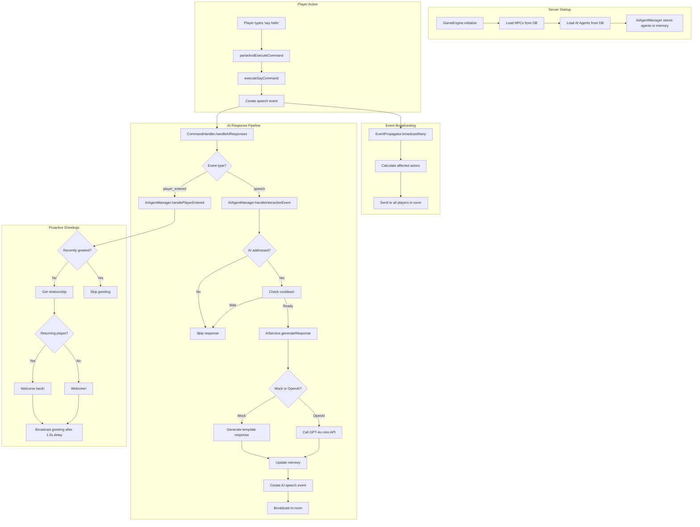
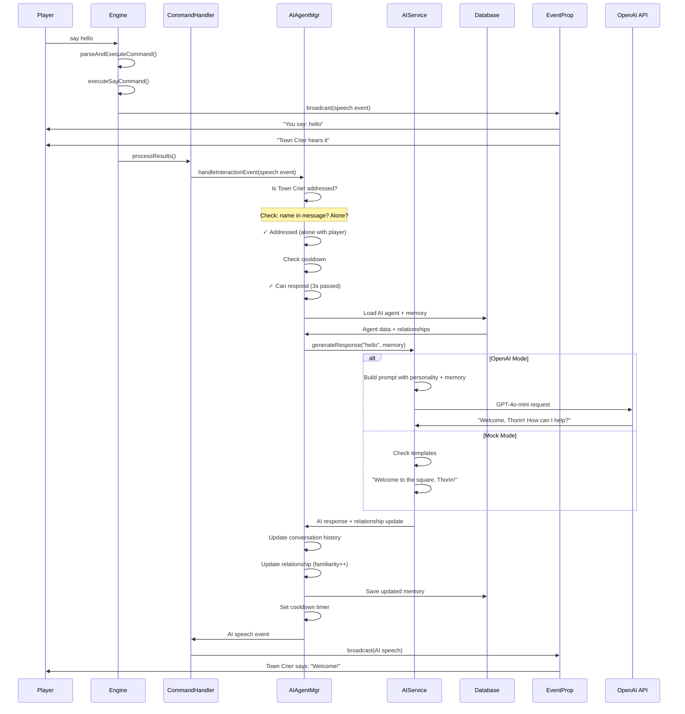
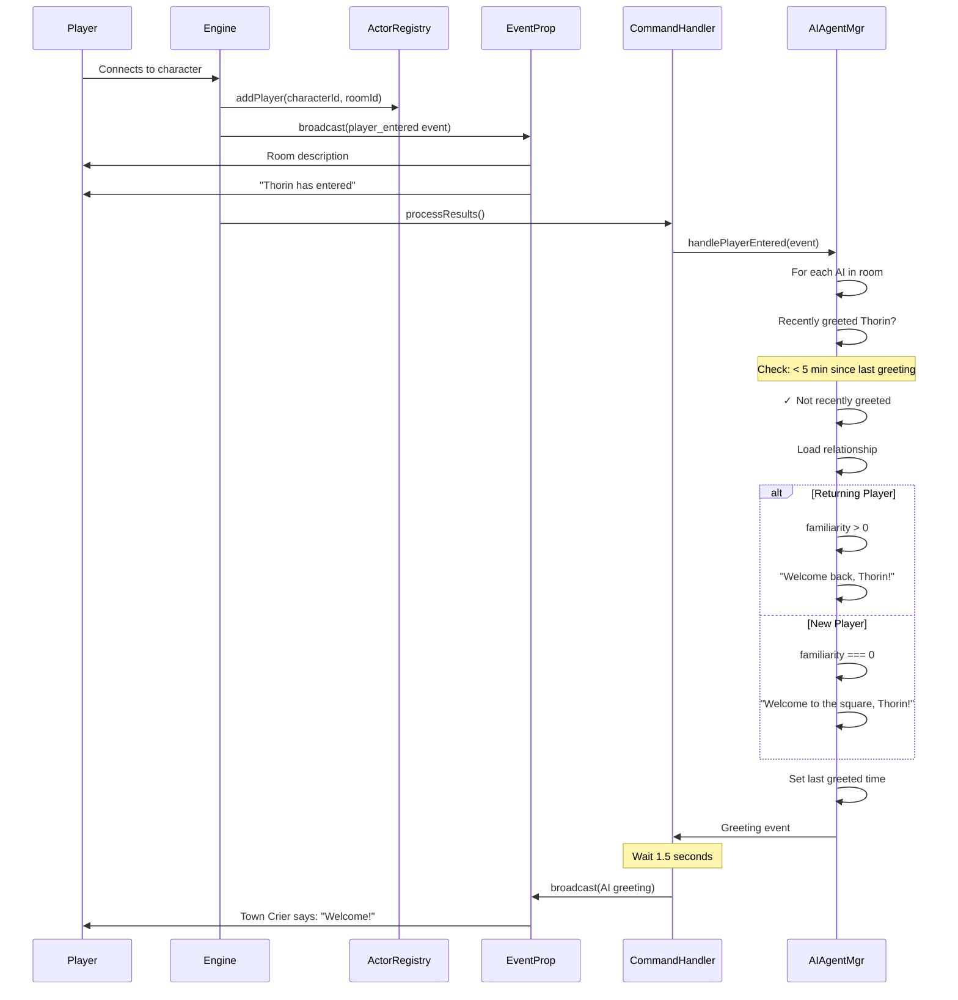
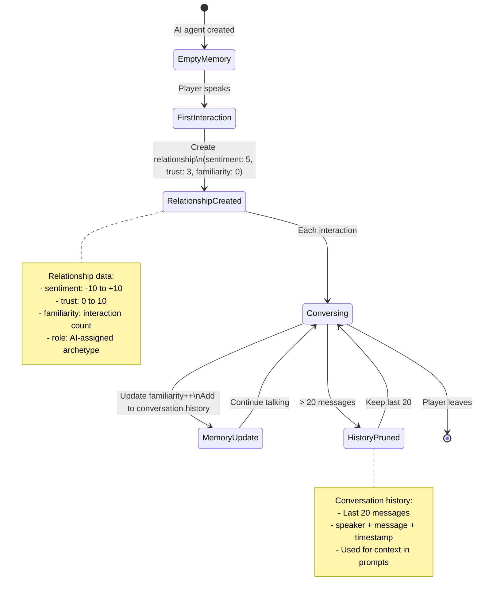

# AI System Architecture - Current Implementation

## High-Level Flow



## Component Breakdown

### 1. AIService (packages/server/src/game/ai-service.ts)

**Responsibility:** Interface to OpenAI API (or mock responses)

```typescript
class AIService {
  private client: OpenAI | null;
  private useMock: boolean;
  
  async generateResponse(
    personality: string,
    playerName: string,
    message: string,
    memory: AIAgentMemory,
    roomContext: string
  ): Promise<AIResponse>
}
```

**Modes:**
- **Mock Mode** (no API key): Template-based responses
  - "Welcome to the square, Thorin!"
  - "Good to see you again!"
  - Fast, free, deterministic
  
- **OpenAI Mode** (with API key): Real AI
  - Model: gpt-4o-mini
  - Max tokens: 150
  - Temperature: 0.8
  - System prompt includes personality + memory

**Memory Structure:**
```typescript
interface AIAgentMemory {
  relationships: Map<string, {
    sentiment: number,      // -10 to +10
    trust: number,          // 0 to 10
    familiarity: number,    // interaction count
    lastSeen: string,
    role: string           // 'newcomer', 'friend', etc
  }>;
  conversationHistory: [{
    speaker: string,
    message: string,
    timestamp: number
  }];
}
```

---

### 2. AIAgentManager (packages/server/src/game/ai-agent-manager.ts)

**Responsibility:** Manages all AI agents, decides when/how they respond

```typescript
class AIAgentManager {
  private agents: Map<characterId, AIAgent>;
  private lastResponseTime: Map<agentId, timestamp>;
  private lastGreetedPlayer: Map<"agentId-playerId", timestamp>;
  
  async handleInteractionEvent(event, charactersInRoom): Promise<GameEvent[]>
  async handlePlayerEntered(event, charactersInRoom): Promise<GameEvent[]>
}
```

**Key Methods:**

**a) shouldRespond(agentId):**
- Checks 3-second cooldown
- Returns true if agent can speak again

**b) shouldReactTo(message, agentName, totalInRoom, eventType):**
- **Explicit targeting:** Message contains agent's name
- **Implicit targeting:** Only 2 people in room (player + AI)
- **Greetings/questions:** Responds to "hello" or "what/where/how" when alone
- **Emotes:** Only responds if named or alone (prevents spam)

**c) handleInteractionEvent(speechEvent):**
1. For each AI agent in room
2. Check if addressed (targeting logic)
3. Check cooldown
4. Generate response via AIService
5. Update memory (relationships + conversation history)
6. Return AI speech event

**d) handlePlayerEntered(enteredEvent):**
1. For each AI agent in room
2. Check if greeted this player recently (5-minute cooldown)
3. Check relationship (new vs returning)
4. Generate personalized greeting
5. Return greeting event (broadcast after 1.5s delay)

---

### 3. CommandHandler (packages/server/src/game/command-handler.ts)

**Responsibility:** Orchestrates post-command side effects

```typescript
class CommandHandler {
  async processResults(result, character): Promise<void> {
    // 1. Broadcast events
    // 2. Handle AI responses
    // 3. Update character stats
    // 4. Handle death
  }
}
```

**AI Response Flow:**
```typescript
private async handleAIResponses(result, character) {
  // Speech responses
  if (speechEvent) {
    const aiResponses = await aiAgentManager.handleInteractionEvent(...);
    broadcast(aiResponses);
  }
  
  // Proactive greetings
  if (playerEnteredEvent) {
    const greetings = await aiAgentManager.handlePlayerEntered(...);
    setTimeout(() => broadcast(greetings), 1500); // Delay for room desc
  }
}
```

---

### 4. Database Schema

```prisma
model AIAgent {
  id                 String   @id
  characterId        String   @unique  // Links to Character
  
  systemPrompt       String   // Personality + backstory
  homeRoomId         String   // Where they belong
  maxRoomsFromHome   Int      // Movement range
  
  relationshipsJson  String   // Map of playerId → relationship data
  conversationJson   String   // Recent conversation history
  
  lastActionAt       DateTime
}
```

**Stored as JSON strings:**
- `relationshipsJson`: `{"thorin": {"sentiment": 7, "trust": 6, ...}}`
- `conversationJson`: `[{"speaker": "Thorin", "message": "hello", ...}]`

---

## Complete Flow: Player Says Hello



---

## Complete Flow: Player Enters Room



---

## Memory Lifecycle



---

## Current Limitations & Next Steps

### What Works Well ✅
- AI responds to targeted speech
- Proactive greetings feel natural
- Memory tracks relationships
- Mock mode for testing
- 3-second cooldown prevents spam

### Current Limitations ❌
1. **No event context** - AI doesn't see combat, deaths, items
2. **Fixed cooldown** - 3s regardless of conversation flow
3. **Simple memory** - Just counters, no understanding
4. **No proactive behavior** - Only greets, doesn't comment
5. **Generic personalities** - All sound similar

### Priority 3: Event Context (Next)

Add recent room events to AI prompt:

```typescript
const roomContext = `
Recent events (last 30s):
- Thorin attacked Goblin for 12 damage
- Goblin HP: 18/30
- Sarah picked up Iron Sword
`;
```

This would make AI say things like:
- "Careful with that goblin, it looks wounded!"
- "I see you found the iron sword!"
- "The fighting has stopped, thankfully."

---

## File Organization

```
game/
├── ai-service.ts (200 lines)
│   └── OpenAI integration + mock mode
│
├── ai-agent-manager.ts (256 lines)
│   ├── Load agents
│   ├── Targeting logic (shouldReactTo)
│   ├── Handle speech events
│   └── Handle player entry (greetings)
│
├── command-handler.ts (92 lines)
│   ├── Process command results
│   ├── Trigger AI responses
│   └── Handle stats/death
│
└── engine.ts (242 lines)
    └── Orchestrates everything
```

---

## Data Flow Summary

**Initialization (Server Start):**
1. GameEngine creates AIService (OpenAI or mock)
2. AIAgentManager created with AIService
3. Load all AIAgent records from database
4. Store in memory: Map<characterId, AIAgent>

**Speech Event:**
1. Player says something
2. Speech event created
3. Event broadcast to all in room
4. CommandHandler calls AIAgentManager
5. For each AI in room:
   - Check if addressed (targeting)
   - Check cooldown
   - Generate response (OpenAI or mock)
   - Update memory (relationships + conversation)
   - Create AI speech event
6. Broadcast AI response

**Player Entry:**
1. Player enters room
2. player_entered event created
3. Event broadcast
4. CommandHandler calls AIAgentManager
5. For each AI in room:
   - Check if recently greeted (5-min cooldown)
   - Get relationship (new vs returning)
   - Generate personalized greeting
   - Record greeting time
   - Create greeting event
6. Wait 1.5 seconds (let player see room first)
7. Broadcast greeting

---

## Configuration

**Cooldowns:**
- Speech response: 3 seconds
- Player greeting: 5 minutes per player

**Memory Limits:**
- Conversation history: 20 messages max
- Relationships: Unlimited (one per player)

**AI Settings:**
- Model: gpt-4o-mini
- Max tokens: 150 per response
- Temperature: 0.8 (creative but coherent)

---

## Key Design Decisions

**1. Event-Driven Architecture**
- No "talk" command - AI reacts to events
- Scalable to many AI agents
- Natural multiplayer experience

**2. Targeting System**
- Prevents cross-talk
- Implicit when alone (natural)
- Explicit when crowded (clear)

**3. Mock Mode First**
- Test without API costs
- Develop faster
- Switch to real AI instantly

**4. Memory in JSON**
- Flexible schema
- Easy to evolve
- Can migrate to vector DB later

**5. Proactive Greetings Only**
- Don't spam with random comments
- Greetings are expected and welcome
- More proactive behavior later (Iteration 4)

