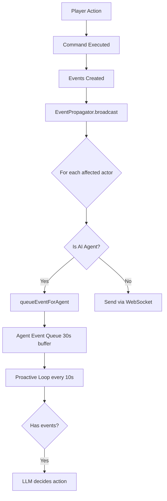

# AI Event Queue Analysis

## Current Implementation

### How Events Flow to AI Agents



### Current Filtering in `queueEventForAgent`

```typescript
queueEventForAgent(agentId: string, event: GameEvent): void {
  // Skip room descriptions
  if (event.type === 'room_description') return;
  
  // Skip events from this agent itself
  if (event.data?.['actorId'] === agentId) return;
  
  // Add to queue (30-second rolling window)
  queue.push(event);
}
```

**Currently accepts:** ALL events except room_description and self-actions

---

## Problems Identified

### Problem 1: No Event Type Discrimination

**Current State:** All agents get all event types in their area

**Examples:**
- **Bartender** receives combat events (doesn't care)
- **Town Crier** receives item pickup events (doesn't care)
- **Goblin** receives emote events (doesn't care unless threatening)

**Result:** Queue fills with noise, LLM sees irrelevant events

---

### Problem 2: 30-Second Window Too Long

**Scenario:**
```
T+0s:  Player enters Forest Path
T+2s:  Player says "hello"
T+5s:  Player leaves
T+20s: Goblin decision loop runs
       Queue: ["player entered", "player said hello", "player left"]
       Goblin is alone, responds to 20-second-old conversation
```

**Result:** Agents acting on stale events when audience is gone

---

### Problem 3: No "Audience Required" Logic

**Bartender emoting alone:**
- Bartender's last event: Someone picked up an item 25 seconds ago
- Player left 20 seconds ago
- Bartender still has event in queue
- Decides to emote "wipes down bar" to empty room

**Result:** Wasted API calls for actions no one sees

---

## Proposed Solutions

### Solution A: Event Type Filtering by Agent Role

Add filtering based on what each agent cares about:

```typescript
interface AgentEventPreferences {
  careAbout: GameEventType[];
  ignoreWhenAlone: boolean; // Ambient agents need audience
}

// In seed or agent config:
townCrier: {
  careAbout: ['speech', 'player_entered', 'player_left', 'death', 'combat'],
  ignoreWhenAlone: true,
}

goblin: {
  careAbout: ['combat', 'player_entered', 'player_left', 'movement', 'death'],
  ignoreWhenAlone: false, // Can chase alone
}

bartender: {
  careAbout: ['speech', 'player_entered', 'player_left'],
  ignoreWhenAlone: true, // Emotes need audience
}
```

**Pros:**
- Precise control over what agents notice
- Reduces queue noise
- Can disable ambient behavior when alone

**Cons:**
- More configuration per agent
- Less flexible (hard to discover new event types to react to)

---

### Solution B: Two-Tier Event Queue

Separate "important" vs "ambient" events:

```typescript
class AIAgentManager {
  private importantEvents = new Map<string, GameEvent[]>(); // combat, death, addressed
  private ambientEvents = new Map<string, GameEvent[]>();   // movement, items, general speech
}

// In proactive loop:
const hasPlayers = await checkPlayersInRoom();

const eventsToConsider = [
  ...importantEvents, // Always consider
  ...(hasPlayers ? ambientEvents : []), // Only if players present
];
```

**Pros:**
- Clear semantic separation
- Ambient actions gated by audience
- Important actions (chase) always available

**Cons:**
- Need to classify every event type
- More complex queue management

---

### Solution C: Event Freshness + Audience Check (Hybrid)

Combine time-based filtering with presence check:

```typescript
// Get very fresh events (last 10 seconds)
const freshEvents = queuedEvents.filter(e => 
  Date.now() - e.timestamp < 10000
);

// Get room context
const hasPlayers = charactersPresent.some(c => c.isPlayer);

// Decision criteria:
if (freshEvents.length === 0) continue; // No fresh events = no action

// For ambient agents (bartender, town crier)
const isAmbientAgent = agent.maxRoomsFromHome === 0;
if (isAmbientAgent && !hasPlayers) continue;

// Hostile/mobile agents can act on fresh events even when alone
```

**Pros:**
- Simple - mostly just reduce time window
- Ambient agents naturally quiet without audience
- Chase works (fresh "player left" event)

**Cons:**
- 10-second window might miss some chase opportunities
- Still some agent type detection needed

---

### Solution D: Smarter Event Filtering in Queue

Filter events AT QUEUE TIME based on content:

```typescript
queueEventForAgent(agentId: string, event: GameEvent): void {
  if (event.type === 'room_description') return;
  if (event.data?.['actorId'] === agentId) return;
  
  // NEW: Filter by relevance
  if (!isEventRelevantToAgent(event, agentId)) return;
  
  queue.push(event);
}

function isEventRelevantToAgent(event: GameEvent, agentId: string): boolean {
  // Always relevant:
  if (['combat', 'death', 'player_entered', 'player_left'].includes(event.type)) {
    return true;
  }
  
  // Speech relevant if:
  // - Agent is mentioned by name
  // - Question is asked
  if (event.type === 'speech') {
    const content = event.content || '';
    // Check if agent name appears in speech (need agent name lookup)
    // Or if it's a question
    return content.includes('?') || content.toLowerCase().includes('crier');
  }
  
  // Movement, items, emotes: only if agent is explicitly involved
  return event.data?.['targetId'] === agentId;
}
```

**Pros:**
- Clean separation: only queue meaningful events
- Queue stays small and focused
- No duplicate filtering in decision loop

**Cons:**
- Need agent name for mention detection
- Might miss some edge cases
- More complex queue logic

---

## My Recommendation

**Solution C (Event Freshness + Audience Check):**

```typescript
// In processProactiveActions:

// 1. Reduce event consideration to 10 seconds (instead of 30)
const freshEvents = queuedEvents.filter(e => Date.now() - e.timestamp < 10000);
if (freshEvents.length === 0) continue;

// 2. Check for players in room (for ambient agents)
const contextData = await buildRoomContext(agent, character);
const hasPlayers = contextData.charactersPresent.some(c => c.isPlayer);

// 3. Ambient agents (maxRoomsFromHome === 0) need audience
const isAmbientAgent = agent.maxRoomsFromHome === 0;
if (isAmbientAgent && !hasPlayers && freshEvents.length > 0) {
  // Check if events are pursuit-worthy
  const hasPursuitEvent = freshEvents.some(e => 
    e.type === 'combat' || e.type === 'death'
  );
  if (!hasPursuitEvent) continue;
}

// 4. Let LLM decide based on fresh events + context
```

**Why:**
- ✅ Fixes bartender emoting alone (ambient agent + no players = skip)
- ✅ Fixes goblin talking to empty room (10s window vs 30s)
- ✅ Enables chase (fresh movement events still processed)
- ✅ Simple - just time filter + basic agent type check
- ✅ Scales well - no per-event-type configuration needed

**Trade-offs:**
- Goblin must act within 10 seconds of player leaving (seems reasonable)
- Ambient agents stuck to their rooms (already true via maxRoomsFromHome)

---

## Pause Button Implementation

Separate from event queue fixes, adding pause functionality:

```typescript
// AIAgentManager
private paused = false;

pauseAll(): void {
  this.paused = true;
}

resumeAll(): void {
  this.paused = false;
}

// In processProactiveActions:
if (this.paused) return; // Skip all processing
```

**Admin UI:**
- Global pause/resume button in header
- Visual indicator when paused
- Persists in memory (resets on server restart)

---

## Questions for You

1. **Event window:** 10 seconds reasonable? Or 15? 5?
2. **Ambient agent detection:** Use `maxRoomsFromHome === 0` or add explicit flag?
3. **Pause functionality:** Global pause or per-agent pause?
4. **Should we implement event filtering now or defer until we see actual behavior?**

What do you think?

