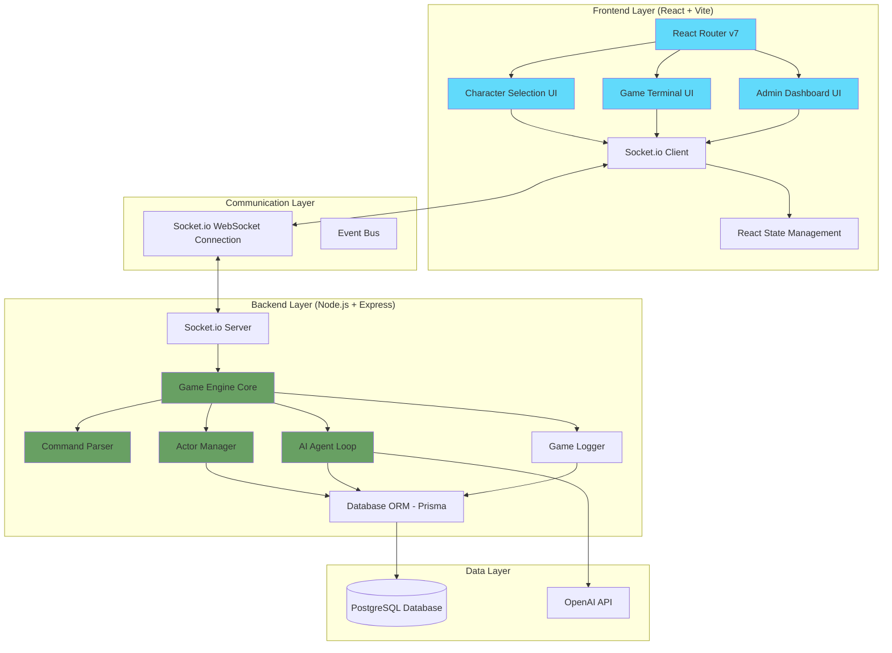
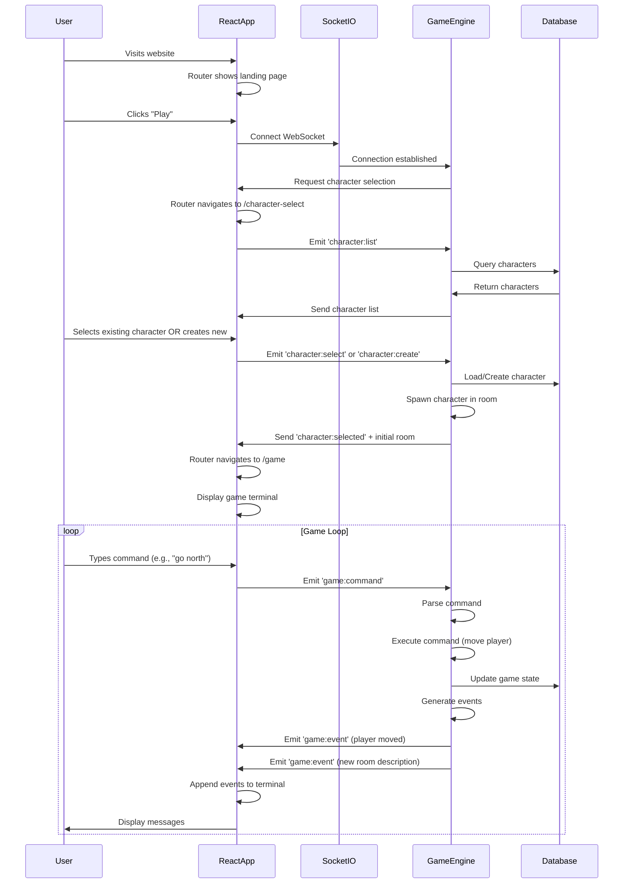
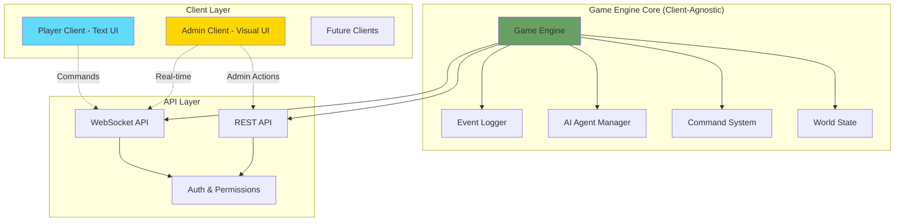

# **Modern MUD with AI Agents - MVP Plan Document**

## **Executive Summary**
Building a real-time, multiplayer text-based dungeon (MUD) with AI-powered NPCs that can interact naturally with players and affect game state. The system will support permanent character death, dynamic world editing, and AI agents with memory and personality.

---

## **Design Philosophy: Core Principles**

### **Principle 1: Modernize the MUD Experience**
This is not a nostalgia project replicating 1980s limitations. We leverage modern web technologies, AI, and UX patterns to create something that feels **contemporary and polished**. Players expect:
- Real-time responsiveness
- Beautiful, readable interfaces
- Smart input assistance
- Rich, contextual information
- Seamless multiplayer interaction
- Intelligent AI companions

**We reject:** Ugly terminal emulators, clunky interfaces, arcane command syntax, slow refresh rates, disconnected experiences.

### **Principle 2: Text is the Medium, Not a Limitation**
Text is our **chosen medium** for storytelling and gameplay, not a technical constraint. Text provides:
- **Infinite detail** without assets (describe anything)
- **Imagination space** (players co-create the experience)
- **Rich narrative** (books > movies for depth)
- **Accessibility** (screenreaders, translations, low bandwidth)
- **Modifiable reality** (AI can generate unique content)
- **Speed** (reading is faster than watching animations)

**We reject:** Treating text as "lesser" than graphics. We don't apologize for being text-based. We don't add graphics "to compensate." Text is our **strength**.

### **The Balance:**
React enhances the **experience of reading and writing**, not the gameplay itself. The game lives in the text. React makes that text beautiful, responsive, and delightful to interact with.

### **Principle 3: AI Enhances, Doesn't Direct**
AI is deeply integrated but serves the experience - it doesn't drive it. The game is:
- **Administrator-driven**: Admins create rooms, NPCs, quests, world content (like a DM)
- **Player-driven**: Players create stories through choices and interactions
- **AI-enhanced**: AI makes NPCs feel alive, generates contextual descriptions, remembers actions

**AI Role:**
- ✅ Makes NPCs feel real (memory, personality, natural dialogue)
- ✅ Enhances descriptions (dynamic text based on context)
- ✅ Narrates mechanical outcomes (combat flavor)
- ✅ Reacts to player actions (contextual responses)

**AI Does NOT:**
- ❌ Generate quests
- ❌ Drive narrative
- ❌ Create content
- ❌ Spawn encounters
- ❌ Manage difficulty/pacing

**The emergent world simulation serves one purpose:** Complex, rewarding narrative moments that are meaningful because of:
- Mechanical depth (like D&D rules enable story)
- Real stakes (permadeath)
- Player-driven action (not scripted)
- AI-enhanced interactions (NPCs feel real)
- Witness and memory (everything matters)

---

## **Core Architecture**

### **System Architecture Overview**

The application is divided into three distinct layers:



### **Responsibility Division**

#### **Frontend (React) Responsibilities:**
- ✅ **UI/UX Layer Only** - No game logic
- ✅ **Routing** (`/`, `/character-select`, `/game`, `/admin`)
- ✅ **Character Selection Screen**
  - Fetch list of player's characters from backend
  - Display dead vs alive characters
  - Create new character form (name input, basic UI)
  - Send character creation/selection to backend
- ✅ **Game Terminal Interface**
  - Display incoming game events/messages
  - Text input for commands
  - Auto-scrolling message feed
  - Visual styling (terminal theme, colors for message types)
- ✅ **Admin Interface** (Phase II)
  - Forms for creating AI agents
  - World editing UI
  - Event log viewer with filters
- ✅ **Client-Side State**
  - Current character data (for UI display)
  - Message history (for display/scrolling)
  - WebSocket connection status
  - UI state (modals, panels, etc.)
- ❌ **Does NOT handle**:
  - Command validation (backend's job)
  - Game state management (backend's job)
  - Combat calculations
  - AI agent logic
  - Any game rules or mechanics

#### **Backend (Game Engine) Responsibilities:**
- ✅ **All Game Logic** - Single source of truth
- ✅ **Character Management**
  - Create characters (validate names, set starting stats)
  - Load character data
  - Track character state (HP, location, inventory, etc.)
- ✅ **Command Processing**
  - Parse text commands
  - Validate commands (permissions, cooldowns, etc.)
  - Execute command logic
  - Update game state
- ✅ **Game State Management**
  - Room state, entity positions
  - Combat calculations
  - Inventory management
  - Death handling
- ✅ **AI Agent System**
  - Agent decision-making loops
  - OpenAI API integration
  - Agent memory management
  - Agent action execution
- ✅ **Event System**
  - Generate events for all game actions
  - Broadcast events to appropriate players
  - Log all events to database
- ✅ **Data Persistence**
  - Save all game state to database
  - Handle transactions
  - Data consistency
- ❌ **Does NOT handle**:
  - UI rendering
  - Routing
  - Visual styling

#### **Communication Protocol (Socket.io Events)**

**Client → Server:**
```typescript
// Character selection/creation (before entering game)
socket.emit('character:list', callback)
socket.emit('character:create', { name: string }, callback)
socket.emit('character:select', { characterId: string }, callback)

// In-game commands (after character selected)
socket.emit('game:command', { command: string })

// Admin actions (Phase II)
socket.emit('admin:create-agent', { agentData }, callback)
socket.emit('admin:create-room', { roomData }, callback)
```

**Server → Client:**
```typescript
// Character data
socket.emit('character:list', { characters: Character[] })
socket.emit('character:created', { character: Character })
socket.emit('character:selected', { character: Character, initialRoom: Room })

// Game events (the core game stream)
socket.emit('game:event', { 
  event: GameEvent // All game events use this structure
})

// Connection status
socket.emit('game:connected', { characterId: string })
socket.emit('game:disconnected', { reason: string })

// Errors
socket.emit('error', { message: string, code: string })
```

### **Example Flow: Player Logs In and Plays**



### **Tech Stack**
- **Frontend**: Vite + React + TypeScript + React Router v7
- **Backend**: Node.js + TypeScript + Express
- **Real-time**: Socket.io (most mature WebSocket library)
- **Database**: SQLite + Prisma ORM (Iteration 0-2), PostgreSQL (Iteration 3+)
- **AI**: OpenAI API with JSON Schema for structured responses
- **Styling**: TailwindCSS (quick, modern, minimal)
- **Monorepo**: npm workspaces (packages/server, packages/client, packages/shared)
- **Deployment**: Render (excellent for Node + WebSockets + PostgreSQL)

---

## **Multi-Client Architecture**

### **Design Principle: Game Engine as Pure API**

The game engine must be **client-agnostic** to support multiple interfaces:
1. **Player Text Interface** - Text-based gameplay experience
2. **Admin Visual Interface** - Visual map editor, NPC creator, world management
3. **Future Clients** - Mobile, voice, replay viewer, analytics dashboard



### **Layer 1: Game Engine Core**

The game engine contains **pure business logic** with no UI concerns:

```typescript
// Game Engine returns structured data, NEVER formatted text
class GameEngine {
  // World state
  private rooms: Map<string, Room>;
  private characters: Map<string, Character>;
  private items: Map<string, Item>;
  private aiAgents: Map<string, AIAgent>;
  
  // Core game operations return structured data
  async executeCommand(
    actorId: string, 
    command: string
  ): Promise<CommandResult> {
    // Parse, validate, execute
    // Returns structured data for ANY client to render
    return {
      success: true,
      events: [
        {
          type: 'movement',
          actorId,
          fromRoomId: 'room1',
          toRoomId: 'room2',
          timestamp: Date.now()
        }
      ],
      stateChanges: {
        actor: { currentRoomId: 'room2' }
      }
    };
  }
  
  // Admin operations
  async createRoom(data: RoomData): Promise<Room> {
    // Validation, creation, persistence
    const room = new Room(data);
    this.rooms.set(room.id, room);
    await this.db.rooms.create({ data: room });
    
    // Emit event for real-time updates
    this.eventBus.emit('room:created', room);
    
    return room;
  }
  
  async updateRoom(roomId: string, updates: Partial<Room>): Promise<Room> {
    const room = this.rooms.get(roomId);
    Object.assign(room, updates);
    await this.db.rooms.update({ where: { id: roomId }, data: updates });
    
    this.eventBus.emit('room:updated', room);
    
    return room;
  }
  
  // Query operations (both clients need these)
  async getRoomState(roomId: string): Promise<RoomState> {
    return {
      room: this.rooms.get(roomId),
      occupants: this.getOccupants(roomId),
      items: this.getItemsInRoom(roomId),
      exits: this.getExits(roomId)
    };
  }
  
  async getWorldGraph(): Promise<WorldGraph> {
    // Return entire world structure for admin visualization
    return {
      rooms: Array.from(this.rooms.values()),
      connections: this.buildConnectionGraph()
    };
  }
}
```

**Key Principle:** Engine returns DATA, not TEXT. Each client decides how to present that data.

### **Layer 2: API Layer**

Exposes game engine functionality through REST and WebSocket APIs:

```typescript
class GameAPI {
  constructor(private engine: GameEngine) {}
  
  // ===== PLAYER ENDPOINTS =====
  
  @WebSocket('game:command')
  async handleCommand(socket: Socket, data: { command: string }) {
    const result = await this.engine.executeCommand(
      socket.playerId,
      data.command
    );
    
    // Broadcast events to affected players
    this.broadcastEvents(result.events);
    
    return result;
  }
  
  @WebSocket('character:select')
  async selectCharacter(socket: Socket, data: { characterId: string }) {
    const character = await this.engine.selectCharacter(
      socket.accountId,
      data.characterId
    );
    
    const initialRoom = await this.engine.getRoomState(character.currentRoomId);
    
    return { character, initialRoom };
  }
  
  // ===== ADMIN ENDPOINTS =====
  
  @Post('/admin/rooms')
  @RequireRole('admin')
  async createRoom(req: Request) {
    const room = await this.engine.createRoom(req.body);
    
    // Notify connected admins via WebSocket
    this.io.to('admin-room').emit('room:created', room);
    
    return { room };
  }
  
  @Put('/admin/rooms/:id')
  @RequireRole('admin')
  async updateRoom(req: Request) {
    const room = await this.engine.updateRoom(
      req.params.id,
      req.body
    );
    
    this.io.to('admin-room').emit('room:updated', room);
    
    return { room };
  }
  
  @Delete('/admin/rooms/:id')
  @RequireRole('admin')
  async deleteRoom(req: Request) {
    await this.engine.deleteRoom(req.params.id);
    
    this.io.to('admin-room').emit('room:deleted', { id: req.params.id });
    
    return { success: true };
  }
  
  @Get('/admin/world-graph')
  @RequireRole('admin')
  async getWorldGraph() {
    return await this.engine.getWorldGraph();
  }
  
  @Post('/admin/npcs')
  @RequireRole('admin')
  async createNPC(req: Request) {
    const npc = await this.engine.createAIAgent(req.body);
    return { npc };
  }
  
  @Post('/admin/items')
  @RequireRole('admin')
  async createItem(req: Request) {
    const item = await this.engine.createItem(req.body);
    return { item };
  }
  
  @Get('/admin/events')
  @RequireRole('admin')
  async queryEvents(req: Request) {
    // Event log viewer
    return await this.engine.queryEvents(req.query);
  }
  
  // ===== SHARED ENDPOINTS =====
  
  @Get('/rooms/:id')
  async getRoom(req: Request) {
    return await this.engine.getRoomState(req.params.id);
  }
}
```

**Permission System:**
```typescript
enum Role {
  Player = 'player',
  Admin = 'admin',
  SuperAdmin = 'super_admin'
}

// Middleware checks role before allowing access
function RequireRole(role: Role) {
  return (target: any, propertyKey: string, descriptor: PropertyDescriptor) => {
    const originalMethod = descriptor.value;
    descriptor.value = async function(...args: any[]) {
      const req = args[0];
      if (!hasRole(req.user, role)) {
        throw new ForbiddenError();
      }
      return originalMethod.apply(this, args);
    };
  };
}
```

### **Layer 3A: Player Client (Text Renderer)**

Consumes structured events and renders as text:

```typescript
class PlayerTextClient {
  constructor(private socket: Socket) {
    this.setupEventHandlers();
  }
  
  setupEventHandlers() {
    // Receive structured events from engine
    this.socket.on('game:event', (event: GameEvent) => {
      const text = this.renderEvent(event);
      this.displayInFeed(text);
    });
  }
  
  renderEvent(event: GameEvent): string {
    switch (event.type) {
      case 'movement':
        return `${event.actorName} moves ${event.direction}.`;
        
      case 'combat':
        return `⚔️ ${event.attackerName} hits ${event.targetName} for ${event.damage} damage\n` +
               `   ${event.targetName}: ${event.targetHp}/${event.targetMaxHp} HP`;
        
      case 'room_description':
        return this.formatRoomDescription(event.data);
        
      case 'speech':
        return `${event.speakerName}: "${event.message}"`;
        
      case 'item_pickup':
        return `${event.actorName} takes ${event.itemName}.`;
        
      case 'death':
        return `💀 ${event.characterName} has died!`;
        
      // ... more event types
    }
  }
  
  formatRoomDescription(data: RoomState): string {
    return `
${data.room.name}

${data.room.description}

Exits: ${data.exits.map(e => e.direction).join(', ')}
${data.occupants.length > 0 ? 'Also here: ' + data.occupants.map(o => o.name).join(', ') : ''}
${data.items.length > 0 ? 'Items: ' + data.items.map(i => i.name).join(', ') : ''}
    `.trim();
  }
  
  sendCommand(command: string) {
    this.socket.emit('game:command', { command });
  }
}

// React component
function GameTextInterface() {
  const [events, setEvents] = useState<GameEvent[]>([]);
  const [inputValue, setInputValue] = useState('');
  
  useEffect(() => {
    socket.on('game:event', (event) => {
      setEvents(prev => [...prev, event]);
    });
  }, []);
  
  return (
    <div className="game-container">
      <GameFeed events={events} />
      <CommandInput 
        value={inputValue}
        onChange={setInputValue}
        onSubmit={(cmd) => socket.emit('game:command', { command: cmd })}
      />
    </div>
  );
}
```

### **Layer 3B: Admin Client (Visual Renderer)**

Consumes SAME structured data but renders visually:

```typescript
class AdminVisualClient {
  private worldGraph: WorldGraph;
  private selectedRoom: Room | null = null;
  
  async initialize() {
    // Load world state
    this.worldGraph = await fetch('/admin/world-graph').then(r => r.json());
    
    // Setup real-time updates
    this.socket.on('room:created', (room) => {
      this.worldGraph.rooms.push(room);
      this.rerenderMap();
    });
    
    this.socket.on('room:updated', (room) => {
      const idx = this.worldGraph.rooms.findIndex(r => r.id === room.id);
      this.worldGraph.rooms[idx] = room;
      this.rerenderMap();
    });
    
    this.socket.on('room:deleted', ({ id }) => {
      this.worldGraph.rooms = this.worldGraph.rooms.filter(r => r.id !== id);
      this.rerenderMap();
    });
  }
}

// React component
function WorldMapEditor() {
  const [worldGraph, setWorldGraph] = useState<WorldGraph | null>(null);
  const [selectedRoom, setSelectedRoom] = useState<Room | null>(null);
  
  useEffect(() => {
    fetch('/admin/world-graph')
      .then(r => r.json())
      .then(setWorldGraph);
      
    socket.on('room:created', (room) => {
      setWorldGraph(prev => ({
        ...prev,
        rooms: [...prev.rooms, room]
      }));
    });
    
    socket.on('room:updated', (room) => {
      setWorldGraph(prev => ({
        ...prev,
        rooms: prev.rooms.map(r => r.id === room.id ? room : r)
      }));
    });
  }, []);
  
  return (
    <div className="admin-container">
      <WorldMapCanvas
        rooms={worldGraph?.rooms}
        connections={worldGraph?.connections}
        onRoomClick={setSelectedRoom}
        onCreateRoom={handleCreateRoom}
        onConnectRooms={handleConnectRooms}
      />
      
      {selectedRoom && (
        <RoomEditorPanel
          room={selectedRoom}
          onUpdate={handleUpdateRoom}
          onDelete={handleDeleteRoom}
        />
      )}
    </div>
  );
}
```

### **Admin Interface Features**

#### **1. Visual World Map**

```
┌───────────────────────────────────────────────┐
│  WORLD MAP                          [+ Room]  │
├───────────────────────────────────────────────┤
│                                               │
│         [Training]───[Town]───[Tavern]       │
│                       │                       │
│                   [Forest]                    │
│                       │                       │
│                    [Cave]                     │
│                                               │
│  • Click to select room                       │
│  • Drag to create connections                 │
│  • Right-click for options                    │
└───────────────────────────────────────────────┘
```

Features:
- Visual node graph of all rooms
- Drag to position rooms
- Click to select/edit
- Lines show connections (labeled with direction)
- Real-time updates as others edit
- Zoom/pan for large worlds

#### **2. Room Editor Panel**

```
┌───────────────────────────────────────────────┐
│  ROOM EDITOR: Town Square         [Save]     │
├───────────────────────────────────────────────┤
│  Name: [Town Square_________________]         │
│                                               │
│  Description:                                 │
│  ┌─────────────────────────────────────────┐ │
│  │ A bustling town square with a fountain │ │
│  │ in the center. Merchants line the...   │ │
│  └─────────────────────────────────────────┘ │
│                                               │
│  Position: X[100] Y[200]                      │
│                                               │
│  Exits:                                       │
│  • North → Forest Path              [Edit]   │
│  • East → Tavern                    [Edit]   │
│  • West → Training Grounds          [Edit]   │
│                            [+ Add Exit]       │
│                                               │
│  Items:                                       │
│  • Wooden Sword                     [Edit]   │
│                            [+ Add Item]       │
│                                               │
│  NPCs:                                        │
│  • Town Crier (AI Agent)            [Edit]   │
│                             [+ Add NPC]       │
│                                               │
│  Spawn Point: ☑ Default spawn location       │
│                                               │
│  Players Currently Here: (2)                  │
│  • Thorin [View]                              │
│  • Sarah [View]                               │
└───────────────────────────────────────────────┘
```

#### **3. NPC Creator**

```
┌───────────────────────────────────────────────┐
│  CREATE AI AGENT                    [Save]    │
├───────────────────────────────────────────────┤
│  Name: [Mysterious Stranger_________]         │
│                                               │
│  Personality:                                 │
│  ┌─────────────────────────────────────────┐ │
│  │ Cryptic and mysterious. Speaks in     │ │
│  │ riddles. Knows secrets about ancient  │ │
│  │ magic and forgotten places.           │ │
│  └─────────────────────────────────────────┘ │
│                                               │
│  Backstory:                                   │
│  ┌─────────────────────────────────────────┐ │
│  │ Former member of a secret order that  │ │
│  │ guarded ancient knowledge. Now wanders│ │
│  │ seeking worthy successors.            │ │
│  └─────────────────────────────────────────┘ │
│                                               │
│  Home Room: [Tavern ▼]                        │
│  Max Distance from Home: [2] rooms            │
│                                               │
│  Capabilities:                                │
│  ☑ Can give quests                            │
│  ☐ Can trade items                            │
│  ☐ Can engage in combat                       │
│  ☑ Can move between rooms                     │
│                                               │
│  Stats:                                       │
│  HP: [100]  Attack: [10]  Defense: [5]       │
│                                               │
│  Knowledge Topics:                            │
│  • ancient_magic                              │
│  • secret_locations                           │
│  • prophecies                                 │
│                            [+ Add Topic]      │
│                                               │
│  Action Cooldowns (ms):                       │
│  Speak: [30000]  Move: [120000]               │
└───────────────────────────────────────────────┘
```

#### **4. Item Creator**

```
┌───────────────────────────────────────────────┐
│  CREATE ITEM                        [Save]    │
├───────────────────────────────────────────────┤
│  Name: [Ancient Sword_______________]         │
│                                               │
│  Description:                                 │
│  ┌─────────────────────────────────────────┐ │
│  │ A blade from a forgotten age, etched  │ │
│  │ with runes that glow faintly in the   │ │
│  │ dark.                                  │ │
│  └─────────────────────────────────────────┘ │
│                                               │
│  Type: [Weapon ▼]                             │
│                                               │
│  Stats:                                       │
│  Damage: [25]  Defense: [0]  Healing: [0]    │
│                                               │
│  Location:                                    │
│  ◉ Room: [Dark Cave ▼]                        │
│  ○ Character Inventory: [Select ▼]           │
│                                               │
│  Quantity: [1]                                │
│  Respawns: ☐ After [___] seconds              │
└───────────────────────────────────────────────┘
```

#### **5. Event Log Viewer**

```
┌───────────────────────────────────────────────┐
│  EVENT LOG                        [Export]    │
├───────────────────────────────────────────────┤
│  Filters:                                     │
│  Room: [All ▼]  Type: [All ▼]  Actor: [All▼] │
│  Time: [Last hour ▼]             [Search]    │
├───────────────────────────────────────────────┤
│  [14:32:15] Thorin: attack goblin             │
│             Combat event (Town Square)        │
│             Damage: 12, Target HP: 8/20       │
│                                               │
│  [14:32:10] Sarah: go north                   │
│             Movement (Town Square → Forest)   │
│                                               │
│  [14:32:05] Town Crier: speech                │
│             "Welcome, Thorin!"                │
│                                               │
│  [14:31:58] Thorin: character selected        │
│             Connection event                  │
└───────────────────────────────────────────────┘
```

### **Data Flow Examples**

#### **Scenario 1: Admin Creates Room**

```
1. Admin clicks "Create Room" on map at (100, 200)
2. Admin Client → POST /admin/rooms
   { 
     name: "New Room",
     description: "A newly created space",
     position: { x: 100, y: 200 }
   }
3. Game Engine:
   - Validates data
   - Creates room entity
   - Persists to database
   - Emits 'room:created' event
4. Admin Client receives WebSocket event:
   'room:created' { room }
5. UI updates: new room appears on map
6. Other connected admin clients also see update
```

#### **Scenario 2: Player Enters Room**

```
1. Player types: "go north"
2. Player Client → WebSocket 'game:command'
   { command: 'go north' }
3. Game Engine:
   - Validates command
   - Checks if north exit exists
   - Moves character
   - Generates events:
     * 'player:left' (old room)
     * 'player:entered' (new room)
     * 'room:description' (for player)
4. Events broadcast via WebSocket:
   - Player receives 'room:description'
   - Other players in old room see 'player:left'
   - Players in new room see 'player:entered'
   - Admin clients update player position on map
5. Player Client renders events as text
6. Admin Client updates visual player marker
```

#### **Scenario 3: Admin Edits NPC While Players Interact**

```
1. Player talks to Town Crier NPC
2. Admin simultaneously edits Town Crier personality
3. Admin Client → PUT /admin/npcs/:id
   { personality: "Updated personality..." }
4. Game Engine:
   - Updates NPC data
   - Next AI interaction uses new personality
5. Current conversation completes with old personality
6. New conversations use updated personality
7. No disruption to active gameplay
```

### **Routing Structure**

```typescript
// Single Vite app with multiple interface routes
const routes = [
  // Public routes
  { path: '/', element: <LandingPage /> },
  
  // Player routes
  { path: '/character-select', element: <CharacterSelect /> },
  { path: '/game', element: <GameTextInterface /> },
  
  // Admin routes (protected)
  { 
    path: '/admin', 
    element: <AdminLayout />,
    children: [
      { index: true, element: <AdminDashboard /> },
      { path: 'map', element: <WorldMapEditor /> },
      { path: 'npcs', element: <NPCManager /> },
      { path: 'items', element: <ItemManager /> },
      { path: 'quests', element: <QuestManager /> },
      { path: 'events', element: <EventLogViewer /> },
      { path: 'players', element: <PlayerManagement /> },
    ]
  },
];
```

### **Technology Choices**

**Monorepo Structure (npm workspaces):**
```
silt/
├── package.json              (root workspace config)
├── packages/
│   ├── server/               (Game engine + API)
│   │   ├── src/
│   │   ├── package.json
│   │   └── tsconfig.json
│   ├── client/               (React app - player & admin UI)
│   │   ├── src/
│   │   ├── package.json
│   │   └── tsconfig.json
│   └── shared/               (Shared types, constants)
│       ├── src/
│       │   ├── types/        (GameEvent, Character, Room, etc.)
│       │   ├── constants/    (EVENT_RANGES, GAME_CONSTANTS)
│       │   └── utils/        (Shared helper functions)
│       ├── package.json
│       └── tsconfig.json
├── scripts/
│   └── check-file-size.js
├── .env.example
└── README.md
```

**Why monorepo:**
- ✅ Share TypeScript types between client and server
- ✅ Single source of truth for game constants
- ✅ Atomic commits across both codebases
- ✅ Easier type safety (no manual sync)
- ✅ Simpler deployment (single repo)

**Backend (packages/server):**
- Game Engine: TypeScript classes (pure logic)
- API: Express + Socket.io
- Database: SQLite (dev) → PostgreSQL (production)
- Real-time: Socket.io rooms for scalable broadcasting

**Frontend (packages/client):**
- Framework: React + Vite
- Routing: React Router v7
- UI: Terminal-style text component (player) + Visual map editor (admin)
- State: Socket.io connection + React state
- Forms: React Hook Form + Zod validation (admin)

**Shared (packages/shared):**
- TypeScript interfaces (GameEvent, Character, Room, Item, etc.)
- Game constants (EVENT_RANGES, GAME_CONSTANTS)
- Utility functions (type guards, validators)
- Branded types (CharacterId, RoomId, ItemId)

### **Key Architectural Decisions**
1. **Account vs Character Separation**: Accounts own multiple Characters. Character death is permanent.
2. **Entity-Based Architecture**: All game objects (players, NPCs, items, spawn points) derive from base Entity class
3. **Entity Targeting**: Everything has unique IDs for precise targeting and filtering
4. **Permission System**: Role-based (Admin/Player), with ownership tracking on rooms/entities
5. **Action Cooldown System**: Unified cooldown system for combat and AI agent actions
6. **Event-Driven with Comprehensive Logging**: All game state changes emit events with structured logging
7. **Centralized Game Constants**: All timing, cooldowns, and combat values abstracted to a config file
8. **Single Source of Truth for Commands**: Command definitions shared between players and AI agents
9. **Unified Actor Interface**: Players and AI agents share the same core interface for taking actions

---

## **Core Design Patterns**

### **1. Entity-Based Architecture**

All game objects inherit from a base `Entity` class for unified handling, filtering, and logging:

```typescript
// Base entity class
abstract class Entity {
  id: string;
  entityType: 'character' | 'item' | 'spawn_point' | 'room';
  name: string;
  createdAt: Date;
  updatedAt: Date;
  metadata: Record<string, any>; // Flexible field for entity-specific data
  
  // Every entity can be referenced in logs and events
  toReference(): EntityReference {
    return {
      id: this.id,
      type: this.entityType,
      name: this.name,
    };
  }
}

// Character entity (players and NPCs)
class Character extends Entity {
  entityType: 'character';
  accountId?: string;
  currentRoomId: string;
  hp: number;
  maxHp: number;
  attackPower: number;
  defense: number;
  inventory: Item[];
  isAlive: boolean;
  spawnPointId: string; // References a spawn point entity
  lastActionAt: Date;
}

// Item entity
class Item extends Entity {
  entityType: 'item';
  itemType: 'weapon' | 'armor' | 'consumable' | 'spawn_point' | 'misc';
  description: string;
  stats?: ItemStats;
  locationId: string; // roomId or characterId
  locationType: 'room' | 'inventory';
}

// Spawn point (special item type)
class SpawnPoint extends Item {
  itemType: 'spawn_point';
  roomId: string; // Where players spawn
  isDefault: boolean; // Default spawn point for new characters
  description: string; // e.g., "A shimmering portal", "An ancient respawn crystal"
}

// Room (collection of entities)
class Room extends Entity {
  entityType: 'room';
  description: string;
  exits: { direction: string; roomId: string }[];
  entities: EntityReference[]; // All entities in this room
  createdBy?: string;
  ambiencePrompt?: string; // For LLM-generated ambience (Phase II)
  lastAmbienceAt?: Date;
}
```

**Benefits**:
- Unified filtering: "Show me all events related to entity X"
- Consistent logging: Every entity has a `toReference()` method
- Type-safe entity relationships
- Easy to extend with new entity types

### **2. Robust Logging & Event System**

Comprehensive event logging for debugging, analytics, and replay:

```typescript
// Event log entry
interface GameEvent {
  id: string;
  timestamp: Date;
  eventType: 
    | 'action'           // Player/AI action (attack, move, etc.)
    | 'combat'           // Combat-specific events
    | 'message'          // Chat/speech
    | 'system'           // System notifications
    | 'ambience'         // Room ambience
    | 'state_change'     // Entity state changes
    | 'connection';      // Player connect/disconnect
  
  // Primary entities involved
  actor?: EntityReference;      // Who performed the action
  target?: EntityReference;     // Who/what was affected
  location?: EntityReference;   // Where it happened (room)
  
  // Related entities (for filtering)
  relatedEntities: EntityReference[];
  
  // Event details
  action?: string;              // Command name (e.g., "attack", "go")
  content?: string;             // Message or description
  data?: Record<string, any>;   // Flexible metadata
  
  // Visibility
  visibility: 'room' | 'global' | 'private'; // Who can see this event
}

// Logging service
class GameLogger {
  // Log an event
  async logEvent(event: Omit<GameEvent, 'id' | 'timestamp'>): Promise<void> {
    const fullEvent: GameEvent = {
      ...event,
      id: generateId(),
      timestamp: new Date(),
    };
    
    // Persist to database
    await db.gameEvent.create({ data: fullEvent });
    
    // Emit real-time
    this.eventEmitter.emit('game:event', fullEvent);
  }
  
  // Query events with filters
  async queryEvents(filters: {
    entityId?: string;           // All events involving this entity
    roomId?: string;             // All events in this room
    eventType?: string[];        // Filter by event types
    actorId?: string;            // All events by this actor
    startTime?: Date;
    endTime?: Date;
    limit?: number;
  }): Promise<GameEvent[]> {
    // Complex query building...
  }
  
  // Real-time event streaming (for admin dashboard)
  streamEvents(filters: EventFilters): EventStream {
    // Returns a stream of events matching filters
  }
}

// Usage example
await gameLogger.logEvent({
  eventType: 'combat',
  actor: player.toReference(),
  target: goblin.toReference(),
  location: room.toReference(),
  relatedEntities: [player.toReference(), goblin.toReference(), room.toReference()],
  action: 'attack',
  content: `${player.name} attacks ${goblin.name} for 15 damage!`,
  data: {
    damage: 15,
    targetHpBefore: 50,
    targetHpAfter: 35,
  },
  visibility: 'room',
});

// Query examples
const allCombatInRoom = await gameLogger.queryEvents({
  roomId: 'town-square',
  eventType: ['combat'],
});

const allPlayerActions = await gameLogger.queryEvents({
  actorId: player.id,
  startTime: new Date(Date.now() - 3600000), // Last hour
});

const allEventsRelatedToGoblin = await gameLogger.queryEvents({
  entityId: goblin.id, // Matches actor, target, or relatedEntities
});
```

**Logging Features**:
- ✅ Filter by any entity (actor, target, or related)
- ✅ Filter by room to see all room activity
- ✅ Filter by event type (combat, chat, movement, etc.)
- ✅ Time-range queries for analytics
- ✅ Real-time event streaming for live monitoring
- ✅ Structured data for replay and analysis

### **3. Game Constants Configuration**

All timing and gameplay values centralized in `config/game-constants.ts`:

```typescript
export const GAME_CONSTANTS = {
  // Combat
  COMBAT: {
    BASE_ATTACK_COOLDOWN: 2000, // ms
    BASE_DAMAGE: 10,
    CRITICAL_HIT_CHANCE: 0.1,
    FLEE_SUCCESS_RATE: 0.7,
  },
  
  // Character Stats
  CHARACTER: {
    STARTING_HP: 100,
    STARTING_ATTACK: 10,
    STARTING_DEFENSE: 5,
  },
  
  // AI Agent Cooldowns
  AI_AGENT: {
    CONVERSE_COOLDOWN: 30000,
    OBSERVE_COOLDOWN: 60000,
    MOVE_COOLDOWN: 120000,
    COMBAT_COOLDOWN: 2000,
    ITEM_INTERACTION_COOLDOWN: 10000,
    MAX_CONVERSATION_HISTORY: 50,
    MAX_ROOMS_FROM_HOME: 3,
  },
  
  // Items
  ITEMS: {
    HEALTH_POTION_HEALING: 50,
    WEAPON_DAMAGE_BONUS: 15,
    ARMOR_DEFENSE_BONUS: 10,
  },
  
  // System
  SYSTEM: {
    COMMAND_RATE_LIMIT: 500, // ms between commands
    MAX_MESSAGE_LENGTH: 500,
  },
};
```

### **2. Unified Command System**

Single source of truth for all commands in `game/commands/registry.ts`:

```typescript
// Command definition interface
interface CommandDefinition {
  name: string;
  aliases: string[];
  description: string;
  usage: string;
  category: 'movement' | 'combat' | 'social' | 'inventory' | 'admin';
  cooldown?: number; // ms, uses default if not specified
  requiredArgs?: string[];
  optionalArgs?: string[];
  execute: (actor: IActor, args: ParsedArgs, context: GameContext) => Promise<CommandResult>;
}

// Example command definitions
export const COMMAND_REGISTRY: CommandDefinition[] = [
  {
    name: 'go',
    aliases: ['move', 'walk'],
    description: 'Move to an adjacent room',
    usage: 'go <direction>',
    category: 'movement',
    requiredArgs: ['direction'],
    execute: async (actor, args, context) => {
      // Implementation
    },
  },
  {
    name: 'attack',
    aliases: ['fight', 'hit'],
    description: 'Attack a target',
    usage: 'attack <target>',
    category: 'combat',
    cooldown: GAME_CONSTANTS.COMBAT.BASE_ATTACK_COOLDOWN,
    requiredArgs: ['target'],
    execute: async (actor, args, context) => {
      // Implementation
    },
  },
  // ... more commands
];

// Generate OpenAI function schemas from command registry
export function generateAIFunctionSchemas(): OpenAIFunctionSchema[] {
  return COMMAND_REGISTRY
    .filter(cmd => cmd.category !== 'admin') // AI agents can't use admin commands
    .map(cmd => ({
      name: cmd.name,
      description: cmd.description,
      parameters: {
        type: 'object',
        properties: generatePropertiesFromArgs(cmd),
        required: cmd.requiredArgs || [],
      },
    }));
}
```

### **3. Unified Actor Interface**

Both players and AI agents implement the same interface:

```typescript
// Core interface that both players and AI agents implement
interface IActor {
  id: string;
  name: string;
  characterId: string;
  currentRoomId: string;
  
  // Action execution (shared logic)
  executeCommand(command: string, args: ParsedArgs): Promise<CommandResult>;
  
  // State queries
  canPerformAction(actionType: string): boolean;
  getStats(): CharacterStats;
  getInventory(): Item[];
  
  // Cooldown management
  setCooldown(actionType: string, duration: number): void;
  getCooldownRemaining(actionType: string): number;
  
  // Messaging
  sendMessage(message: GameMessage): void;
  receiveEvent(event: GameEvent): void;
}

// Human player implementation
class Player implements IActor {
  constructor(
    private socket: Socket,
    private character: Character
  ) {}
  
  async executeCommand(command: string, args: ParsedArgs): Promise<CommandResult> {
    // Lookup command in registry and execute
    return await executeFromRegistry(this, command, args);
  }
  
  sendMessage(message: GameMessage): void {
    this.socket.emit('game:message', message);
  }
  
  // ... other implementations
}

// AI agent implementation
class AIAgent implements IActor {
  constructor(
    private character: Character,
    private agentData: AIAgentData,
    private openAIClient: OpenAI
  ) {}
  
  async executeCommand(command: string, args: ParsedArgs): Promise<CommandResult> {
    // Same command execution as players!
    return await executeFromRegistry(this, command, args);
  }
  
  sendMessage(message: GameMessage): void {
    // AI agents don't have sockets, but might log or store messages
    this.agentData.conversationHistory.push(message);
  }
  
  // AI-specific: decide what to do
  async decideAction(context: RoomContext): Promise<{command: string, args: ParsedArgs}> {
    const availableFunctions = generateAIFunctionSchemas();
    const response = await this.openAIClient.chat.completions.create({
      model: 'gpt-4',
      messages: this.buildPrompt(context),
      functions: availableFunctions,
      function_call: 'auto',
    });
    
    // Parse AI response into command + args
    return parseAIResponse(response);
  }
  
  // ... other implementations
}

// Game engine works with IActor, doesn't care if it's a player or AI
class GameEngine {
  async processAction(actor: IActor, command: string, args: ParsedArgs) {
    // Check cooldown
    if (!actor.canPerformAction(command)) {
      actor.sendMessage({ type: 'error', content: 'Action on cooldown' });
      return;
    }
    
    // Execute through unified interface
    const result = await actor.executeCommand(command, args);
    
    // Broadcast results to room
    this.broadcastToRoom(actor.currentRoomId, result);
  }
}
```

**Key Benefits**:
- **DRY Principle**: Command logic written once, used by both players and AI
- **Consistency**: AI agents can't do anything players can't do (and vice versa)
- **Maintainability**: Update a command once, both players and AI get the update
- **Testability**: Test command logic independent of whether it's a player or AI executing it
- **Extensibility**: Easy to add new commands that automatically become available to AI agents

---

## **AI Integration Strategy**

### **Problem 1: Contextual Memory at Scale**

AI agents will interact with many players. Full conversation history is impractical due to:
- Token limits
- API costs
- Performance concerns

**Solution: Tiered Memory System**

#### **Tier 1: Relationship Graph (Always Loaded)**

Lightweight, fast, always available:

```typescript
AIAgent.relationships = {
  "thorin": {
    sentiment: 7,        // -10 to +10
    trust: 6,
    familiarity: 3,      // Number of interactions
    lastSeen: "2 hours ago",
    role: "helpful_adventurer",  // AI-assigned archetype
  },
  "sarah": {
    sentiment: 4,
    trust: 2,
    familiarity: 1,
    lastSeen: "5 minutes ago",
    role: "newcomer",
  }
}
```

**Purpose:** Quick personality adjustment based on who the agent is talking to.

#### **Tier 2: Significant Events Only (Vector DB)**

Don't store full conversations - store **outcomes and significant moments**:

```typescript
// DON'T STORE:
"Player: Hi, how are you?"
"Agent: I'm well, thank you!"
"Player: What's north?"
"Agent: There's a forest path..."

// DO STORE:
{
  event: "thorin_warned_about_goblins",
  timestamp: Date,
  summary: "Thorin warned town about goblin army",
  mechanical_impact: "triggered_defense_preparation",
  emotional_weight: 8  // Importance score
}
```

**What counts as "significant"?**
- ✅ Combat outcomes
- ✅ Quests accepted/completed
- ✅ Major decisions
- ✅ Deaths witnessed
- ✅ Betrayals, alliances, conflicts
- ✅ Gifts given/received
- ❌ Casual greetings
- ❌ Repeated questions
- ❌ Mundane interactions

**Storage:** Vector database for semantic search. "What does agent remember about Thorin?" → Top 3-5 relevant memories.

#### **Tier 3: Recent Context Window (Last 10 Messages)**

For active conversation only:

```typescript
AIAgent.currentContext = [
  { player: "thorin", said: "I found goblins north" },
  { agent: "town_crier", said: "How many?" },
  { player: "thorin", said: "At least a dozen" },
  // ...last 10 messages
]
```

**Flushes when player leaves room.**

#### **How AI Constructs Prompt**

```typescript
function buildAgentPrompt(agent: AIAgent, player: Player) {
  return {
    // Core personality (admin-defined)
    personality: agent.personality,
    backstory: agent.backstory,
    
    // Tier 1: Relationship (always included)
    relationship: agent.relationships.get(player.id),
    
    // Tier 2: Top 3-5 significant memories (vector search)
    significantMemories: await vectorDB.search({
      query: currentContext,
      filter: { agentId: agent.id, playerId: player.id },
      limit: 5
    }),
    
    // Tier 3: Current conversation
    recentMessages: agent.currentContext,
    
    // Current room context
    roomContext: {
      occupants: getRoomOccupants(),
      items: getRoomItems(),
      recentEvents: getRecentRoomEvents()
    }
  };
}
```

**Result:** Agent "remembers" important things without full history.

#### **Memory Pruning**

```typescript
class MemoryManager {
  async pruneMemories(agent: AIAgent) {
    agent.memories.forEach(memory => {
      if (isOld(memory) && !isImportant(memory)) {
        // Compress to summary
        memory.detail = null;
        memory.summary = "Had minor interaction";
      }
    });
  }
}
```

### **Problem 2: Signal vs Noise**

LLMs can ramble. Players want gameplay, not endless chat.

**Solution: Mechanics First, Narrative Second**

#### **Rule: Engine Decides Outcomes, LLM Describes**

```typescript
// WRONG: LLM decides combat outcome
> attack goblin
[LLM: "The goblin dodges and you miss"]
// LLM just controlled mechanics - BAD

// RIGHT: Mechanics decide, LLM narrates
> attack goblin
[Engine: hit=true, damage=12, goblinHP=8/20]
[LLM: "Your sword slices across the goblin's chest"]
// LLM only provides flavor - GOOD
```

**Separation of Concerns:**
- **Game Engine:** Hit/miss, damage, death, loot
- **LLM:** Description, personality, emotional response

#### **Constrained LLM Output**

```typescript
interface CombatNarration {
  narration: string;        // Max 100 characters
  enemyQuip?: string;      // Optional, max 50 characters
}

const prompt = `
Generate brief combat narration.
Context: ${attacker} hit ${target} for ${damage} damage.

Rules:
- Maximum 100 characters
- One sentence only
- Focus on action, not exposition

Return JSON only.
`;
```

#### **Template + LLM Hybrid**

```typescript
// Use templates 70% of the time (fast, cheap, predictable)
// Use LLM 30% of the time (variety, personality)

const templates = {
  player_hits_enemy: [
    "You strike {target} for {damage} damage!",
    "Your {weapon} connects ({damage} damage)",
  ]
};

function generateCombatText(event: CombatEvent) {
  if (Math.random() < 0.7) {
    return fillTemplate(templates.player_hits_enemy, event);
  } else {
    return generateWithLLM(event);  // Adds personality
  }
}
```

**Benefits:**
- Fast and cheap most of the time
- LLM adds occasional variety
- Always coherent and brief

#### **Separate Mechanical and Narrative Layers**

Players see both:

```
═══════════════════════════════════════
⚔️ You hit Goblin for 12 damage
   Goblin: 8/20 HP
═══════════════════════════════════════

Your sword bites deep. The goblin snarls.

> _
```

**Mechanical layer:**
- Always present
- Always accurate
- Always instant
- Never LLM-generated

**Narrative layer:**
- Enhancement
- Can be slow (LLM latency)
- Can be disabled
- Adds personality

#### **AI Agents Must Affect Mechanics**

Every AI interaction should have gameplay impact:

```typescript
// BAD: Pure dialogue
Bartender: "Oh hello! How are you? The weather..."
[Endless rambling, no gameplay]

// GOOD: Dialogue + mechanical action
Bartender: "You look capable. I'll pay 50 gold to 
clear the northern path."

[Mechanical: Quest offered]
[accept] [decline]
```

**Every AI interaction:**
- ✅ Advances game state
- ✅ Provides actionable information
- ✅ Offers choices with consequences
- ✅ Triggers mechanical systems
- ❌ No chat for chat's sake

#### **Information Density**

```typescript
// WRONG: Verbose prose
"You find yourself in a sprawling town square, 
the cobblestones beneath your feet weathered by 
countless travelers..."

// RIGHT: Dense, actionable
"Town Square. Fountain in center.
Exits: north, east, west
Occupants: Town Crier, Sarah
Items: wooden sword"

[Use "examine" for detailed LLM descriptions]
```

**Default:** Information first. Prose is opt-in.

#### **AI Agent Action Budgets**

Prevent spam:

```typescript
class AIAgent {
  actionBudget = {
    speak: { cooldown: 30000, lastUsed: 0 },    // 30s
    move: { cooldown: 120000, lastUsed: 0 },    // 2min
    emote: { cooldown: 60000, lastUsed: 0 },    // 1min
  };
}
```

**AI agents act deliberately, not constantly.**

### **The 10-Minute Player Session Loop**

1. **Explore** → AI generates discoverable moments
2. **Discover** → AI makes discoveries meaningful
3. **Combat/Encounter** → AI creates stakes & narrative
4. **Share** → AI facilitates storytelling

**Example:**
```
> go north

[Mechanical: Move to Forest Path]
[AI: Contextual description with clues]

> examine tracks

[Mechanical: Reveals information]
[AI: Generates details that matter]

> follow tracks

[Mechanical: Triggers encounter]
[AI: Creates emergent situation]

Combat with goblin
[Mechanics handle damage, HP, death]
[AI provides narrative flavor]

> return to town

[Mechanical: Move to Town Square]
[AI: Town Crier asks about adventure]
[Your story becomes world content]
```

**AI's Role at Each Step:**
- **Explore:** Generate clues, contextual descriptions
- **Discover:** Connect discoveries to larger story
- **Combat:** Narrate mechanical outcomes
- **Share:** NPCs ask about adventures, update world state

**Key Principle:** Mechanical loop stays the same. Narrative loop never repeats.

---

## **Phase I: MVP Core Features**

### **1. Data Models**

All models inherit from base Entity structure (see Entity-Based Architecture above).

**Account** (Phase II - stub for now)
- Future: username, password hash, email
- For MVP: Just username to connect

**Character** (extends Entity)
- entityType: 'character'
- accountId: string | null (null for MVP, links to Account in Phase II)
- currentRoomId: string
- spawnPointId: string (references SpawnPoint entity)
- hp, maxHp, attackPower, defense: number (basic stats)
- inventory: Item[]
- isAlive: boolean
- lastActionAt: Date

**Room** (extends Entity)
- entityType: 'room'
- description: string
- exits: { direction: string; roomId: string }[]
- entities: EntityReference[] (all entities currently in room)
- createdBy: string | null (accountId for future permissions)
- ambiencePrompt: string | null (Phase II - LLM prompt for generating ambience)
- lastAmbienceAt: Date | null (track last ambience generation)

**Item** (extends Entity)
- entityType: 'item'
- itemType: 'weapon' | 'armor' | 'consumable' | 'spawn_point' | 'misc'
- description: string
- stats: ItemStats | null ({damage?, healing?, defense?})
- locationId: string (roomId or characterId)
- locationType: 'room' | 'inventory'

**SpawnPoint** (special Item subtype)
- itemType: 'spawn_point'
- roomId: string (where characters spawn)
- isDefault: boolean (default spawn for new characters)
- description: string (e.g., "A shimmering portal")
- **Note**: Spawn points are items that exist in rooms. Characters reference which spawn point is theirs.

**AIAgent**
- id: string
- characterId: string (links to Character entity)
- systemPrompt: string (personality/backstory)
- homeRoomId: string
- maxRoomsFromHome: number
- conversationHistory: GameEvent[] (recent events/messages)
- lastActionAt: Date
- actionCooldowns: { actionType: string; expiresAt: Date }[]

**GameEvent** (comprehensive event log)
- id: string
- timestamp: Date
- eventType: 'action' | 'combat' | 'message' | 'system' | 'ambience' | 'state_change' | 'connection'
- actor: EntityReference | null
- target: EntityReference | null
- location: EntityReference | null (room)
- relatedEntities: EntityReference[]
- action: string | null (command name)
- content: string | null (message or description)
- data: JSON | null (flexible metadata)
- visibility: 'room' | 'global' | 'private'

**ActionCooldown** (embedded in Character)
- characterId: string
- actionType: string
- cooldownMs: number
- lastUsedAt: Date

---

### **2. Core Systems**

#### **A. Connection & Character Management**
- WebSocket connection with username (no auth for MVP)
- Character creation flow: name selection, starting stats
- Character selection if account has multiple (dead characters shown but not selectable)
- Disconnect handling (character stays in world for reconnection)

#### **B. Room Navigation System**
- Commands: `look`, `go <direction>`, `exits`
- Real-time updates when players/agents enter/leave rooms
- Entity listing with unique identifiers (e.g., "goblin.1", "goblin.2")

#### **C. Inventory & Item System**
- Commands: `inventory`, `take <item>`, `drop <item>`, `examine <item>`
- Equipment: `equip <weapon>`, `unequip <weapon>` (affects combat stats)
- Items spawned in rooms, lootable from defeated enemies

#### **D. Combat System**
- Commands: `attack <target>`, `flee`
- Real-time with cooldowns (e.g., attack every 2 seconds)
- Simple damage calculation: attacker.attackPower - target.defense
- Death: Character marked isAlive=false, drops inventory, removed from room
- PvP enabled (attack other players)
- Combat log broadcasts to room

#### **E. Communication System**
- Commands: `say <message>`, `emote <action>`
- Real-time chat visible to all in room
- AI agents can participate in conversations
- Action/combat logs intermixed with chat

#### **F. AI Agent System**

**Agent Loop Architecture**:
- Agents subscribe to room events (player enters, speech, actions)
- Proactive actions via cooldown-based action queue
- Action types:
  - `converse`: Talk to players (30s cooldown)
  - `observe`: Look around room (60s cooldown)
  - `move`: Walk to adjacent room (120s cooldown, respects maxRoomsFromHome)
  - `combat`: Attack if threatened (2s cooldown, same as players)
  - `item_interaction`: Take/use items (10s cooldown)

**OpenAI Integration**:
```typescript
// JSON Schema for structured responses
{
  "actionType": "converse" | "move" | "combat" | "observe" | "item_interaction",
  "target": "entity.id or direction",
  "content": "what to say or do",
  "reasoning": "internal thought process"
}
```

**Memory System**:
- Last N messages from room conversations stored in agent's history
- Agent system prompt includes personality, backstory, current room context
- Memory pruning to keep context within token limits

**Agent Creation** (Admin Interface):
- Form: name, personality prompt, home room, initial stats
- Creates Character + AIAgent entries
- Spawns in designated home room

---

### **3. World Editing System (Architecture Only)**

**Phase I Implementation**:
- Hardcode starter world in seed data
- Database schema supports createdBy field

**Future Phase II**:
- Commands: `create room <name>`, `create exit <direction> <targetRoom>`, `edit room description <text>`
- Admin commands: `create agent`, `spawn item <itemType>`
- Permission checks against room ownership and role

---

### **4. Command Parser**

```typescript
// Command structure
interface Command {
  verb: string; // "go", "attack", "say", etc.
  target?: string; // entity ID or direction
  args?: string[]; // additional parameters
  rawInput: string;
}
```

**Entity Resolution**:
- When multiple entities share a name, auto-index them (goblin.1, goblin.2)
- Parser resolves "goblin" to first match, "goblin.2" to specific entity
- Fuzzy matching for typos (optional for MVP)

---

### **5. Starter World**

**Rooms**:
1. **Town Square** (spawn point)
   - Exits: north (Forest Path), east (Tavern), west (Training Grounds)
   - NPCs: Town Crier (AI agent, welcomes new players)
   - Items: Wooden Sword (on ground)

2. **Tavern**
   - Exits: west (Town Square)
   - NPCs: Bartender (AI agent, gives hints about dungeon)
   - Items: Health Potion

3. **Training Grounds**
   - Exits: east (Town Square)
   - NPCs: Training Dummy (non-AI, for combat practice)
   - Items: Leather Armor

4. **Forest Path**
   - Exits: south (Town Square), north (Dark Cave)
   - NPCs: Goblin (AI agent, hostile, guards cave)
   - Items: None

5. **Dark Cave**
   - Exits: south (Forest Path)
   - NPCs: None initially
   - Items: Treasure Chest (rare weapon)

**AI Agents**:
- **Town Crier**: Friendly, helpful, explains game mechanics, never leaves Town Square
- **Bartender**: Mysterious, shares lore, hints at dangers, stays in Tavern
- **Goblin**: Aggressive, warns players away, may attack if provoked, patrols between Forest Path and cave entrance

---

## **Phase I Development Order**

### **Sprint 1: Foundation** (Core Infrastructure)
1. Project setup (Vite + TypeScript + Socket.io)
2. Database schema (Prisma) + migrations
3. WebSocket connection handling
4. Basic command parser
5. Room navigation system
6. Character creation/selection

### **Sprint 2: Gameplay Core**
1. Inventory system
2. Item interactions (take, drop, examine, equip)
3. Combat system with cooldowns
4. Death handling
5. Real-time chat/communication
6. Starter world seed data

### **Sprint 3: AI Agents**
1. OpenAI API integration with JSON schema
2. Agent decision-making loop
3. Agent memory system
4. Action cooldown system for agents
5. Agent creation interface (admin)
6. Seed starter NPCs

### **Sprint 4: Polish & Testing**
1. Error handling & edge cases
2. UI improvements (terminal-style interface)
3. Help system/command list
4. Multi-user testing & bug fixes
5. Performance optimization

---

## **Phase II: Future Features** (Post-MVP)

1. **Authentication**: Login/registration, session management
2. **World Editing**: In-game room/item creation commands with permissions
3. **Advanced Combat**: Skills, spells, status effects, armor system
4. **Room Ambience System**: Thematic ambient events for atmosphere (see details below)
5. **Quests**: Quest system with AI-generated objectives
6. **Economy**: Currency, shops, trading between players
7. **Guilds/Parties**: Player groups with shared inventories
8. **AI Enhancements**: Long-term memory, emotional states, relationship tracking
9. **Admin Dashboard**: Web interface for world management

### **Room Ambience System** (Phase II Feature)

**Purpose**: Add atmospheric immersion without overwhelming players with random events.

**Design**:
- Each room has a predefined list of 5-10 ambient messages
- System randomly selects and broadcasts one message to all players in the room
- Timer-based: broadcast every 2-5 minutes (configurable per room)
- Messages are thematic, subtle, and non-intrusive

**Example Ambience Events**:

*Town Square*:
- "A gentle breeze carries the scent of fresh bread from a nearby bakery."
- "The town crier rings his bell, announcing the hour."
- "Children laugh as they chase each other around the fountain."
- "A merchant closes up shop, dragging heavy crates inside."
- "Pigeons scatter as a cart rolls across the cobblestones."

*Tavern*:
- "The fire in the hearth crackles and pops."
- "Someone in the corner starts humming a melancholy tune."
- "The bartender wipes down the counter with a weathered rag."
- "Laughter erupts from a table of card players."
- "The smell of roasted meat wafts from the kitchen."

*Dark Cave*:
- "Water drips somewhere in the darkness."
- "A cold draft makes the torchlight flicker."
- "You hear the distant echo of something moving."
- "Loose rocks skitter down from above."
- "The oppressive silence is almost tangible."

**Implementation**:
```typescript
// Room schema includes
interface Room {
  // ... other fields
  ambienceEvents: string[];
  ambienceInterval: number; // ms between events (default: 180000 = 3 min)
}

// Ambience service
class AmbienceService {
  startRoomAmbience(roomId: string) {
    const room = getRoomById(roomId);
    if (!room.ambienceEvents.length) return;
    
    setInterval(() => {
      const event = room.ambienceEvents[
        Math.floor(Math.random() * room.ambienceEvents.length)
      ];
      
      broadcastToRoom(roomId, {
        type: 'ambience',
        content: event,
        timestamp: Date.now(),
      });
    }, room.ambienceInterval);
  }
}
```

**Configuration Options** (for world builders):
- Enable/disable ambience per room
- Adjust frequency (quiet rooms vs busy rooms)
- Time-of-day variants (future enhancement)
- Event conditions (only play when X players present, etc.)

---

## **Phase III: Advanced Features** (Future Exploration)

### **1. LLM-Modulated Perceptions**
**Concept**: Instead of players seeing raw world data, an LLM interprets and describes the environment based on:
- Character's stats, state, and background
- Lighting conditions, time of day
- Character's mental state (injured, poisoned, etc.)
- Recent events and emotional context

**Example**:
- **Raw Data**: "Town Square. Exits: north, east, west. NPCs: Town Crier. Items: Wooden Sword"
- **LLM Description** (healthy character): "You stand in the bustling Town Square, sunlight warming the cobblestones. A cheerful Town Crier waves at passersby near the fountain. A weathered wooden practice sword lies abandoned by the fountain's edge."
- **LLM Description** (injured character): "You stumble into the Town Square, each breath sending sharp pain through your ribs. Through blurred vision, you make out the Town Crier's concerned expression. A wooden sword on the ground seems impossibly far away."

**Implementation Considerations**:
- Caching for common scenarios to reduce API costs
- Fallback to standard descriptions if LLM fails
- Balance between immersion and information clarity
- Toggle for players who prefer raw data

### **2. Procedural Generation**: AI-generated rooms and quests

---

## **Technical Considerations**

### **Scalability: Socket.io Rooms Architecture (CRITICAL)**

**Problem:** Broadcasting to all connected players doesn't scale beyond 50-100 players.

**Solution:** Room-based architecture from Iteration 0 (not optional).

```typescript
// WRONG: Broadcast to all connected clients
io.emit('game:event', event);  // Sends to EVERYONE (doesn't scale)

// RIGHT: Broadcast only to players in same game room
io.to(`room:${roomId}`).emit('game:event', event);  // Only players in this room
```

#### **Implementation (Iteration 0)**

**Core Architecture: Actor Registry + Event Propagation**

```typescript
// Layer 1: Track ALL actors (players + AI agents)
interface ActorLocation {
  actorId: string;
  actorType: 'player' | 'ai_agent';
  roomId: string;
  socketId?: string;  // Only players have sockets
}

class ActorRegistry {
  private actors = new Map<string, ActorLocation>();
  private roomOccupants = new Map<string, Set<string>>();  // roomId → actorIds
  private socketToActor = new Map<string, string>();
  private actorToSocket = new Map<string, string>();
  
  addPlayer(playerId: string, roomId: string, socketId: string) {
    this.actors.set(playerId, { 
      actorId: playerId, 
      actorType: 'player', 
      roomId, 
      socketId 
    });
    this.socketToActor.set(socketId, playerId);
    this.actorToSocket.set(playerId, socketId);
    this.addToRoom(playerId, roomId);
  }
  
  addAIAgent(agentId: string, roomId: string) {
    this.actors.set(agentId, { 
      actorId: agentId, 
      actorType: 'ai_agent', 
      roomId 
    });
    this.addToRoom(agentId, roomId);
  }
  
  private addToRoom(actorId: string, roomId: string) {
    const occupants = this.roomOccupants.get(roomId) || new Set();
    occupants.add(actorId);
    this.roomOccupants.set(roomId, occupants);
  }
  
  moveActor(actorId: string, fromRoomId: string, toRoomId: string) {
    this.roomOccupants.get(fromRoomId)?.delete(actorId);
    this.addToRoom(actorId, toRoomId);
    
    const actor = this.actors.get(actorId);
    if (actor) actor.roomId = toRoomId;
  }
  
  getActorsInRoom(roomId: string): Set<string> {
    return this.roomOccupants.get(roomId) || new Set();
  }
  
  getSocketId(actorId: string): string | undefined {
    return this.actorToSocket.get(actorId);
  }
  
  isPlayer(actorId: string): boolean {
    return this.actors.get(actorId)?.actorType === 'player';
  }
}

// Layer 2: Calculate which actors receive which events
class EventPropagator {
  constructor(
    private roomGraph: RoomGraph,
    private actorRegistry: ActorRegistry
  ) {}
  
  /**
   * Calculate which actors (players + AI agents) receive this event
   * Returns Map of actorId → potentially modified event
   */
  calculateAffectedActors(event: GameEvent): Map<string, GameEvent> {
    const affected = new Map<string, GameEvent>();
    const range = EVENT_RANGES[event.type] ?? 0;
    
    // Get all rooms within range
    const roomsInRange = this.roomGraph.getRoomsWithinDistance(
      event.originRoomId,
      range
    );
    
    // For each room, get ALL actors and attenuate event
    for (const [roomId, distance] of roomsInRange) {
      const actorsInRoom = this.actorRegistry.getActorsInRoom(roomId);
      const attenuatedEvent = this.attenuateEvent(event, distance, roomId);
      
      for (const actorId of actorsInRoom) {
        affected.set(actorId, attenuatedEvent);
      }
    }
    
    return affected;
  }
  
  private attenuateEvent(
    event: GameEvent,
    distance: number,
    targetRoomId: string
  ): GameEvent {
    if (distance === 0) return event;
    
    // Attenuate based on event type and distance
    switch (event.type) {
      case 'combat_start':
        return {
          ...event,
          type: 'ambient',
          content: distance === 1
            ? 'You hear sounds of combat nearby.'
            : 'You hear distant fighting.',
          attenuated: true
        };
      case 'death':
        const direction = this.roomGraph.getDirectionBetween(
          targetRoomId,
          event.originRoomId
        );
        return {
          ...event,
          type: 'ambient',
          content: `A scream echoes from ${direction || 'nearby'}.`,
          attenuated: true
        };
      default:
        return event;
    }
  }
}

// Layer 3: Deliver events to actors
class EventDeliverySystem {
  constructor(
    private io: Server,
    private actorRegistry: ActorRegistry,
    private aiAgentManager: AIAgentManager
  ) {}
  
  /**
   * Deliver events to affected actors
   * Players get WebSocket messages, AI agents get queued events
   */
  async deliverEvents(affectedActors: Map<string, GameEvent>) {
    for (const [actorId, event] of affectedActors) {
      if (this.actorRegistry.isPlayer(actorId)) {
        // Send to player via socket
        const socketId = this.actorRegistry.getSocketId(actorId);
        if (socketId) {
          this.io.to(socketId).emit('game:event', event);
        }
      } else {
        // Queue event for AI agent to process
        await this.aiAgentManager.queueEventForAgent(actorId, event);
      }
    }
  }
}

// High-level event system (what game code uses)
class EventSystem {
  constructor(
    private propagator: EventPropagator,
    private delivery: EventDeliverySystem,
    private logger: GameLogger
  ) {}
  
  /**
   * Broadcast any game event - ONLY method game code calls
   */
  async broadcast(event: GameEvent) {
    // 1. Calculate affected actors (game logic)
    const affectedActors = this.propagator.calculateAffectedActors(event);
    
    // 2. Deliver to players (WebSocket) and AI agents (event queue)
    await this.delivery.deliverEvents(affectedActors);
    
    // 3. Send to admins (monitoring)
    this.delivery.sendToAdmins(event);
    
    // 4. Log to database
    await this.logger.logEvent(event);
  }
}
```

#### **AI Agent Event Processing**

AI agents receive events and can react:

```typescript
class AIAgentManager {
  private agentEventQueues = new Map<string, GameEvent[]>();
  
  async queueEventForAgent(agentId: string, event: GameEvent) {
    const queue = this.agentEventQueues.get(agentId) || [];
    queue.push(event);
    this.agentEventQueues.set(agentId, queue);
    
    // Trigger agent to process events (debounced)
    this.scheduleAgentProcessing(agentId);
  }
  
  private async scheduleAgentProcessing(agentId: string) {
    const agent = await this.getAgent(agentId);
    if (!agent.canAct()) return;  // Check cooldowns
    
    const events = this.agentEventQueues.get(agentId) || [];
    if (events.length === 0) return;
    
    // Agent decides what to do based on events
    const decision = await agent.decideAction(events);
    
    if (decision) {
      // Agent executes action through normal command system
      await this.executeAgentAction(agent, decision);
    }
    
    // Clear processed events
    this.agentEventQueues.set(agentId, []);
  }
}
```

**Example: AI Agent Hears Combat**

```
1. Player attacks goblin in Forest Path
2. EventSystem.broadcast({ type: 'combat_start', originRoomId: 'forest', ... })
3. EventPropagator calculates affected actors:
   - Players in Forest Path (distance 0)
   - Players in Town Square (distance 1) 
   - AI agent "Town Crier" in Town Square (distance 1)
4. EventDeliverySystem:
   - Sends to player sockets
   - Queues event for Town Crier AI
5. Town Crier processes event:
   - Hears "sounds of combat nearby"
   - Decides to warn other players
   - Shouts: "I hear fighting in the forest! Someone help!"
```

#### **Scalability Math**

**With actor-based targeting:**
- 1000 players, 100 AI agents across 200 rooms
- 1 combat event in Town Square (range: 1)
- Event propagator finds 3 affected rooms with ~18 total actors
- Delivery system: 15 socket sends + 3 AI event queues
- **~20 operations per event**

**100x more efficient than broadcasting to all connected clients.**

#### **Event Propagation System (Range-Based Broadcasting)**

Different events propagate different distances - this is a **core gameplay feature**.

```typescript
// Event range configuration
const EVENT_RANGES = {
  whisper: 0,          // Only current room
  speech: 0,           // Only current room
  emote: 0,            // Only current room
  
  combat_start: 1,     // Adjacent rooms hear "sounds of combat"
  combat_hit: 0,       // Only current room sees details
  death: 2,            // Death screams carry 2 rooms
  
  movement: 0,         // Only room you're leaving/entering
  
  shout: 3,            // Shouts carry 3 rooms
  explosion: 5,        // Major events carry far
  
  admin_action: 0,     // Only affects target room
  global: Infinity,    // Server announcements
};

interface GameEvent {
  type: string;
  originRoomId: string;
  range: number;       // How many rooms away to propagate
  content: string;
  attenuated?: string; // What distant rooms hear
}
```

#### **Room Graph Distance Calculation**

Maintain a distance cache for efficient lookup:

```typescript
class RoomGraph {
  private adjacencyMap: Map<string, string[]>;  // roomId -> [neighborIds]
  private distanceCache: Map<string, Map<string, number>>;
  
  constructor(rooms: Room[]) {
    this.buildGraph(rooms);
    this.precomputeDistances();
  }
  
  private buildGraph(rooms: Room[]) {
    this.adjacencyMap = new Map();
    
    for (const room of rooms) {
      const neighbors: string[] = [];
      for (const exit of room.exits) {
        neighbors.push(exit.roomId);
      }
      this.adjacencyMap.set(room.id, neighbors);
    }
  }
  
  // BFS to find all rooms within N steps
  getRoomsWithinDistance(originRoomId: string, maxDistance: number): Map<string, number> {
    const distances = new Map<string, number>();
    const queue: Array<[string, number]> = [[originRoomId, 0]];
    const visited = new Set<string>();
    
    while (queue.length > 0) {
      const [roomId, distance] = queue.shift()!;
      
      if (visited.has(roomId)) continue;
      visited.add(roomId);
      distances.set(roomId, distance);
      
      if (distance >= maxDistance) continue;
      
      const neighbors = this.adjacencyMap.get(roomId) || [];
      for (const neighborId of neighbors) {
        if (!visited.has(neighborId)) {
          queue.push([neighborId, distance + 1]);
        }
      }
    }
    
    return distances;
  }
  
  // Get distance between two specific rooms
  getDistance(roomA: string, roomB: string): number {
    return this.distanceCache.get(roomA)?.get(roomB) ?? Infinity;
  }
}
```

#### **Intelligent Event Broadcasting**

```typescript
class EventBroadcaster {
  constructor(
    private io: Server,
    private roomGraph: RoomGraph
  ) {}
  
  broadcastEvent(event: GameEvent) {
    const range = EVENT_RANGES[event.type] ?? 0;
    
    // Get all rooms within range
    const affectedRooms = this.roomGraph.getRoomsWithinDistance(
      event.originRoomId,
      range
    );
    
    // Broadcast with distance-based attenuation
    for (const [roomId, distance] of affectedRooms) {
      const attenuatedEvent = this.attenuateEvent(event, distance);
      this.io.to(`room:${roomId}`).emit('game:event', attenuatedEvent);
    }
    
    // Always send full detail to admins
    this.io.to('admin:all').emit('admin:event', event);
  }
  
  private attenuateEvent(event: GameEvent, distance: number): GameEvent {
    if (distance === 0) {
      // Same room: full detail
      return event;
    }
    
    // Distant rooms get modified content
    switch (event.type) {
      case 'combat_start':
        return {
          ...event,
          type: 'ambient',
          content: distance === 1 
            ? 'You hear sounds of combat nearby.'
            : 'You hear distant sounds of fighting.',
          attenuated: true
        };
        
      case 'death':
        return {
          ...event,
          type: 'ambient',
          content: distance === 1
            ? 'A death scream echoes from nearby.'
            : 'You hear a faint scream in the distance.',
          attenuated: true
        };
        
      case 'shout':
        return {
          ...event,
          content: event.attenuated || event.content,
          clarity: distance === 0 ? 'clear' : 'muffled'
        };
        
      default:
        return event;
    }
  }
}
```

#### **Usage Example**

```typescript
// Player attacks in room
async function handleAttack(playerId: string, targetId: string) {
  const player = getPlayer(playerId);
  const target = getPlayer(targetId);
  
  // Calculate damage (mechanics)
  const damage = calculateDamage(player, target);
  target.hp -= damage;
  
  // Broadcast with range
  eventBroadcaster.broadcastEvent({
    type: 'combat_hit',
    originRoomId: player.currentRoomId,
    range: 0,  // Only this room sees details
    content: `${player.name} hits ${target.name} for ${damage} damage!`
  });
  
  // If target dies
  if (target.hp <= 0) {
    eventBroadcaster.broadcastEvent({
      type: 'death',
      originRoomId: player.currentRoomId,
      range: 2,  // Death screams carry 2 rooms
      content: `${target.name} has died!`,
      attenuated: `A death scream echoes from ${getDirectionTo(player.currentRoomId)}.`
    });
  }
}

// Player shouts
async function handleShout(playerId: string, message: string) {
  const player = getPlayer(playerId);
  
  eventBroadcaster.broadcastEvent({
    type: 'shout',
    originRoomId: player.currentRoomId,
    range: 3,
    content: `${player.name} shouts: "${message}"`,
    attenuated: `Someone shouts in the distance: "${message}"`
  });
}
```

#### **Performance Optimization**

**Cache room distances on server start:**
```typescript
// Precompute distances between all rooms (once)
const roomGraph = new RoomGraph(allRooms);

// Update cache when admin adds/removes rooms
eventBus.on('room:created', () => roomGraph.rebuild());
```

**For 1000 rooms:**
- BFS is O(V + E) ≈ O(1000) per event
- With average 5 events/second across all rooms = 5000 operations/sec
- Modern CPU can handle millions of operations/sec
- **No problem for scale**

#### **Socket.io Channel Usage: Minimal**

```typescript
// Only ONE channel used for game events:
'admin:all'  // All admins subscribe to this for monitoring

// Everything else: direct socket ID targeting
io.to(socketId).emit('game:event', event);  // Specific player
// NOT using room channels for game events

// Why?
// - Players get events via socket IDs (calculated by propagator)
// - AI agents don't have sockets (use event queues instead)
// - Admins use one channel (simpler for admin management)
```

**This architecture separates:**
- **Game logic** (which actors are affected?) → EventPropagator
- **Transport layer** (how to deliver?) → EventDeliverySystem
- **AI reactivity** (what do AI agents do?) → AIAgentManager

#### **Gameplay Benefits**

This system enables rich atmospheric gameplay:

```
You're in the Tavern.
> look

Tavern. A cozy fireplace warms the room.
You see: Bartender (NPC), Sarah (player)
Exits: west (Town Square)

You hear sounds of combat to the west.

> go west

Town Square. A fountain sits in the center.
You see: Thorin (player), Goblin (NPC) - FIGHTING
Exits: north, east, south, west

Thorin is locked in combat with a goblin!

> shout Help in the town square!

You shout: "Help in the town square!"

[Players in Tavern, Training Grounds, and Forest Path all hear the shout]
```

#### **Why This Must Be in Iteration 0**

- **Refactoring later is painful**: Changing broadcast patterns across entire codebase
- **Testing scales early**: Validates architecture with many rooms
- **No performance surprises**: Know it scales from day 1
- **Admin features depend on it**: Admin UI needs room-specific subscriptions

**Bottom line:** With 1000+ players, Socket.io rooms are **non-negotiable**.

---

### **Database Scalability**
- **Iteration 0-2:** SQLite (file-based, zero setup, perfect for development)
- **Iteration 3+:** PostgreSQL (when adding AI, need better concurrent write handling)
- Connection pooling for database
- Indexed lookups on frequently queried fields (roomId, characterId)

### **API Rate Limiting**
- Rate limiting on commands (prevent spam): 1 command per 500ms per player
- AI request queuing to manage OpenAI API costs/limits

### **Data Consistency**
- Optimistic locking for concurrent actions (e.g., two players taking same item)
- Transaction handling for complex operations (combat, trading)

### **AI Cost Management**
- Token limits per agent response
- Cache common agent responses
- Cooldowns prevent excessive API calls

### **Testing Strategy**
- Unit tests for game logic (combat, inventory, permissions)
- Integration tests for command handling
- Manual testing for AI agent behaviors
- Load testing for concurrent connections

---

## **MVP Success Criteria**

✅ Multiple players can connect and interact in real-time  
✅ Players can navigate rooms, see each other, and chat  
✅ Combat system works for PvP and vs AI agents  
✅ Inventory and item system functional  
✅ Character death is permanent; accounts can create new characters  
✅ AI agents have personalities, memory, and can take autonomous actions  
✅ AI agents respond to players naturally via OpenAI  
✅ Starter world is playable with 3+ AI agents  
✅ Admin can create new AI agents through interface  
✅ Action cooldown system prevents spam  
✅ Database persists all game state  

---

---

## **Incremental Development Strategy**

### **Guiding Principles**
1. **Playable ASAP** - Get something fun working in days, not weeks
2. **Iterate & Expand** - Each iteration adds meaningful functionality
3. **Test with Real Play** - Validate each iteration by actually playing
4. **Mechanics First, AI Later** - Prove core gameplay before AI complexity

---

### **Iteration 0: Proof of Concept (1-2 days)**
**Goal:** Two players can connect, move between rooms, and see each other.

**Deliverables:**
- [ ] Monorepo structure (packages/server, packages/client, packages/shared)
- [ ] Basic Express + Socket.io server
- [ ] Room graph system with distance calculation
- [ ] Range-based event broadcasting (Socket.io rooms)
- [ ] Hardcoded 3 rooms in memory (Town, Forest, Cave)
- [ ] Basic React client with text feed and input
- [ ] WebSocket connection handling
- [ ] Commands: `look`, `go <direction>`, `say <message>`, `shout <message>`
- [ ] Real-time updates when players move/talk
- [ ] `.env.example` with configuration

**What You Can Do:**
- Connect as "Player1" and "Player2"
- Navigate between 3 rooms
- See when others enter/leave
- Chat with each other
- Shout and hear it from adjacent rooms
- See room descriptions

**Validation:** Two people can explore and chat in real-time. Player in Tavern hears combat in Town Square (1 room away).

**No Database Yet:** Everything in memory. Server restart = reset.

---

### **Iteration 1: Core Gameplay Loop (2-3 days)**
**Goal:** Add combat, items, and character death. Playable game loop exists.

**Deliverables:**
- [ ] Database (SQLite + Prisma - file-based, zero setup)
- [ ] Prisma schema for Character, Room, Item entities
- [ ] Character creation (name, starting stats)
- [ ] Inventory system
- [ ] Items in rooms (take, drop, examine, equip)
- [ ] Basic combat (attack command, HP, damage calculation)
- [ ] Permadeath (character dies, create new one)
- [ ] 5-room starter world with items (seeded to database)
- [ ] Hardcoded "Goblin" enemy (non-AI, scripted responses)
- [ ] Combat events propagate to adjacent rooms ("You hear sounds of combat nearby")

**What You Can Do:**
- Create a character
- Explore 5 rooms
- Pick up weapons and armor
- Fight a goblin
- Die (permanently) and create new character
- See other players' actions in real-time
- Hear combat from adjacent rooms

**Validation:** Complete a 10-minute session: explore → find weapon → fight goblin → die or win → share experience with another player.

**Still No AI:** Goblin has scripted responses ("Goblin attacks you!", "Goblin dies!").

**Database:** SQLite file in `packages/server/dev.db` (gitignored).

---

### **Iteration 2: Character Persistence & Selection (1-2 days)**
**Goal:** Multiple characters per account. Death matters more.

**Deliverables:**
- [ ] Account system (simple username, no password yet)
- [ ] Character selection screen
- [ ] List characters (alive vs dead)
- [ ] Spawn points (as items in rooms)
- [ ] Character stats display on UI

**What You Can Do:**
- Create multiple characters
- See your dead characters (grayed out, not selectable)
- Choose which character to play
- Feel the weight of permadeath

**Validation:** Play through with 2-3 characters. Kill one off. Feel emotional impact of seeing them in your dead list.

---

### **Iteration 3: First AI Agent (2-3 days)**
**Goal:** One NPC comes alive with AI.

**Deliverables:**
- [ ] Migrate database: SQLite → PostgreSQL (better concurrent writes for AI)
- [ ] OpenAI API integration with environment variables
- [ ] OpenAI cost controls (token limits, rate limiting, daily budget)
- [ ] AI Agent system (basic)
- [ ] Town Crier NPC (AI-powered)
- [ ] Simple memory (Tier 1: relationship tracking only)
- [ ] Constrained output (max 150 tokens, JSON schema)
- [ ] AI can talk and remember you
- [ ] Template + LLM hybrid system (70/30 split)

**What You Can Do:**
- Talk to Town Crier
- Town Crier remembers your name
- Town Crier responds differently based on familiarity
- Town Crier provides hints about the world
- See occasional LLM-generated responses mixed with templates

**Validation:** Have a 5-turn conversation with Town Crier that feels natural and remembers context. API costs stay under $0.10 for the session.

**Keep It Simple:** No proactive AI behavior yet. AI only responds when spoken to.

**Database Migration:** Prisma migrate from SQLite to PostgreSQL is straightforward - just update DATABASE_URL.

---

### **Iteration 4: AI Memory & Significant Events (2-3 days)**
**Goal:** AI remembers important things you do.

**Deliverables:**
- [ ] Event logging system
- [ ] Significant event detection
- [ ] Tier 2 memory (significant events stored)
- [ ] AI prompt includes past events
- [ ] Add Bartender NPC (AI-powered)

**What You Can Do:**
- Defeat goblin, return to town
- Town Crier: "I heard combat in the north! Are you alright?"
- Bartender: "I heard you defeated a goblin. Brave soul."
- AI NPCs reference your actions

**Validation:** Kill goblin. Talk to 2 different NPCs. Both acknowledge what you did in different ways.

---

### **Iteration 5: Command Registry & Actor System (2-3 days)**
**Goal:** Unified command system. AI can take same actions as players.

**Deliverables:**
- [ ] Command registry (single source of truth)
- [ ] IActor interface
- [ ] Player and AIAgent both implement IActor
- [ ] AI agents can use commands (move, examine, emote)
- [ ] Add Goblin as AI agent (not scripted)

**What You Can Do:**
- AI Goblin can move between rooms
- AI Goblin examines items
- AI Goblin attacks players (proactively!)
- AI NPCs feel more alive

**Validation:** Watch AI Goblin patrol between Forest and Cave. Encounter it unexpectedly.

---

### **Iteration 6: Admin Interface - Phase 1 (3-4 days)**
**Goal:** Admin can create rooms visually.

**Deliverables:**
- [ ] Admin role system
- [ ] `/admin` routes (protected)
- [ ] World map visualization (React Flow or Canvas)
- [ ] Room editor panel
- [ ] Create/edit/delete rooms via UI
- [ ] Real-time updates

**What You Can Do (as admin):**
- See entire world as visual map
- Click to select room, edit description
- Create new room by clicking on canvas
- Connect rooms by dragging
- Watch players move around on map

**Validation:** Create a new room, add exits, have player explore it - all through UI, no code changes.

---

### **Iteration 7: Admin Interface - Phase 2 (3-4 days)**
**Goal:** Admin can create items and AI NPCs.

**Deliverables:**
- [ ] Item creator UI
- [ ] NPC creator UI
- [ ] Place items in rooms via UI
- [ ] Spawn NPCs in rooms via UI
- [ ] Edit NPC personalities
- [ ] Event log viewer

**What You Can Do (as admin):**
- Create "Ancient Sword" item, place in Cave
- Create new AI NPC "Mysterious Stranger"
- Edit Town Crier's personality while players interact
- View event log filtered by room or player

**Validation:** Create entire mini-quest (NPC, item, enemy) through admin UI. Have player experience it without code changes.

---

### **Iteration 8: Polish & Enhancement (2-3 days)**
**Goal:** Make it feel good to play.

**Deliverables:**
- [ ] Improved text styling (colors, formatting)
- [ ] Command autocomplete
- [ ] Command history (up/down arrows)
- [ ] Help system
- [ ] Better error messages
- [ ] Landing page with instructions
- [ ] Ambient room events (Phase II feature)

**What You Can Do:**
- Experience polished, beautiful text interface
- Get smart command suggestions
- Press up to repeat commands
- Type `help` for guidance
- See occasional atmospheric messages

**Validation:** Show game to friend who's never seen it. They can figure it out without you explaining.

---

### **Iteration 9: AI Enhancement (2-3 days)**
**Goal:** Make AI feel truly intelligent.

**Deliverables:**
- [ ] Tier 3 memory (conversation context)
- [ ] Vector database for memory search
- [ ] AI proactive behavior (with cooldowns)
- [ ] Cross-agent memory sharing
- [ ] AI-generated room descriptions (contextual)

**What You Can Do:**
- AI NPCs initiate conversations
- AI NPCs share information with each other
- Town Crier knows what Bartender told you
- Room descriptions change based on recent events
- AI NPCs feel genuinely intelligent

**Validation:** Talk to Town Crier, then Bartender. Bartender references your conversation with Town Crier. Mind = blown.

---

### **Iteration 10: MVP Complete (1-2 days)**
**Goal:** Final testing, bug fixes, documentation.

**Deliverables:**
- [ ] Bug fixes from testing
- [ ] Performance optimization
- [ ] README with setup instructions
- [ ] Basic authentication (Phase II feature)
- [ ] Deploy to hosting
- [ ] Invite friends to playtest

**What You Can Do:**
- Share link with friends
- Watch multiple people play simultaneously
- See emergent stories happen
- Celebrate!

**Validation:** 5+ people can play for 30+ minutes each and have fun.

---

## **Timeline Summary**

| Iteration | Duration | Cumulative | Playable? | AI? |
|-----------|----------|------------|-----------|-----|
| 0: Proof of Concept | 1-2 days | 2 days | ✅ Basic | ❌ |
| 1: Core Gameplay | 2-3 days | 5 days | ✅ Yes! | ❌ |
| 2: Persistence | 1-2 days | 7 days | ✅ Better | ❌ |
| 3: First AI | 2-3 days | 10 days | ✅ Exciting | ✅ Basic |
| 4: AI Memory | 2-3 days | 13 days | ✅ Impressive | ✅ Good |
| 5: Unified Actors | 2-3 days | 16 days | ✅ Dynamic | ✅ Great |
| 6: Admin UI - Rooms | 3-4 days | 20 days | ✅ Scalable | ✅ Great |
| 7: Admin UI - Full | 3-4 days | 24 days | ✅ Complete | ✅ Great |
| 8: Polish | 2-3 days | 27 days | ✅ Polished | ✅ Great |
| 9: AI Enhanced | 2-3 days | 30 days | ✅ Amazing | ✅ Exceptional |
| 10: MVP Done | 1-2 days | 32 days | ✅ Production | ✅ Exceptional |

**Total: ~4-5 weeks to MVP**

---

## **Key Decision Points**

### **After Iteration 1:**
- ✅ Is the core gameplay loop fun?
- ✅ Do combat and death feel meaningful?
- ✅ Do players want to keep playing?

**If NO:** Iterate on game design before adding AI.
**If YES:** Proceed to AI integration.

### **After Iteration 3:**
- ✅ Does AI feel natural and helpful?
- ✅ Is AI worth the API cost?
- ✅ Do AI interactions enhance gameplay?

**If NO:** Rethink AI integration strategy.
**If YES:** Proceed to more AI features.

### **After Iteration 6:**
- ✅ Can admins create content easily?
- ✅ Is admin UI intuitive?
- ✅ Does visual map help or confuse?

**If NO:** Simplify admin interface.
**If YES:** Add more admin features.

---

## **What to Build First Each Day**

### **Day 1 (Iteration 0):**
- Morning: Server + Socket.io setup
- Afternoon: Basic React client + 3 rooms
- Evening: Movement and chat commands

### **Day 3 (Iteration 1 start):**
- Morning: Database schema + Prisma setup
- Afternoon: Character creation
- Evening: Combat system

### **Day 4:**
- Morning: Items and inventory
- Afternoon: Death handling
- Evening: Test full gameplay loop

### **Day 7 (Iteration 3 start):**
- Morning: OpenAI API integration
- Afternoon: Basic AI agent system
- Evening: Test Town Crier conversations

---

## **Success Metrics**

**After Iteration 1:**
- [ ] 2+ people can play simultaneously
- [ ] Average session: 10+ minutes
- [ ] Players die at least once
- [ ] Players want to try again after death

**After Iteration 5:**
- [ ] AI NPCs feel alive
- [ ] Players talk to NPCs without prompting
- [ ] AI interactions create memorable moments
- [ ] API costs are manageable (<$1/hour of gameplay)

**After Iteration 10:**
- [ ] 10+ people have played
- [ ] Average session: 30+ minutes
- [ ] Players create their own stories
- [ ] At least 1 "remember when..." moment shared
- [ ] People want to play again tomorrow

---

## **Next Steps**

Ready to begin **Iteration 0: Proof of Concept**.

**First commits:**
1. Initialize Vite + React + TypeScript
2. Initialize Express + Socket.io server
3. Create basic client-server connection
4. Hardcode 3 rooms in memory
5. Implement `look` and `go` commands

**Let's build something playable!**

